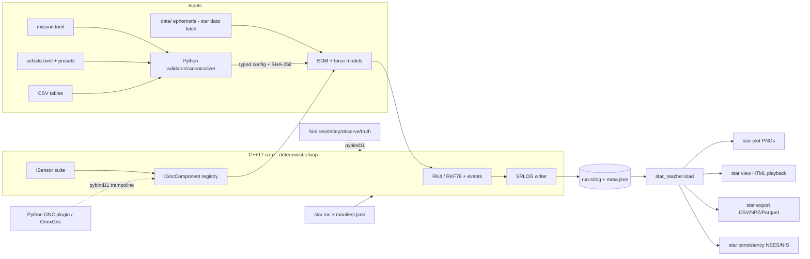

# star_reacher — Product Requirements Document

**Author:** Melvin Hoyer III
**Date:** 2026-07-02
**Status:** Baseline for phased execution
**Repository:** https://github.com/JusHoya/star_reacher

---

## 1. Overview & Vision

star_reacher is a deterministic, high-fidelity six-degree-of-freedom space mission simulator for launch vehicles, satellites, and lunar/Mars missions, built as a small C++17/Eigen compute core behind a Python analysis frontend. The same inputs and the same binary always produce bit-identical outputs; every physical model is derived in a LaTeX math library document, validated against golden vectors, analytic solutions, and cross-tool baselines, and documented in a scientific report. Vehicle definitions are a curated, KSP-lite parameter set — enough knobs for serious scientific study, few enough to never overwhelm — and the whole system is operated through single commands, runs on hardware from a Raspberry Pi 5 to a workstation, and carries AI/ML navigation hooks (stepping API, sensor emulation, GNC plugin interface, training-data export) designed in from the first commit.

The experience: edit a vehicle or mission TOML, run one command, get a reproducible binary log, one more command to plot or replay it in 3D; every logged quantity traces to a derived, cited, and tested model.

## 2. Target User & Context

The primary user is the author: a lead GNC systems engineer with graduate-level astrodynamics and expert inertial-navigation/Kalman-filtering background, using the sim for mission analysis, GNC algorithm development, and — as the strategic goal — world-model and AI/ML spacecraft navigation research. Secondary users are engineers and researchers of similar background who clone the repo, run `star verify`, and extend it. Documentation is written for a technical peer. Usage contexts: interactive desktop analysis, headless batch Monte Carlo on modest hardware (including ARM single-board computers), and Python-in-the-loop ML experimentation. The sim is a research instrument, not a game and not an operational flight tool.

## 3. Goals & Non-Goals

### Goals

1. **Truth-model 6DOF**: full rigid-body translational and rotational dynamics with time-varying mass properties, suitable as ground truth for GNC and navigation research.
2. **Scientific fidelity, scrutinized**: every model carries a first-principles derivation, explicit domain-of-validity bounds, and validation evidence (golden vectors, analytic benchmarks, cross-tool comparison against GMAT).
3. **Determinism as a feature**: bit-identical reruns on the same platform/binary; bounded, measured, documented divergence across platforms.
4. **Small without fidelity loss**: Eigen is the only mandatory core dependency; a bespoke binary log instead of HDF5; a self-contained HTML viewer instead of a native 3D app; trimmed ephemeris data instead of a SPICE link. Minimality is CI-enforced, not aspirational: the installed runtime dependency set must exactly equal the D-12 allowed-list and wheels must stay within the FR-32 size budget.
5. **Hardware floor**: Raspberry Pi 5 (aarch64) through desktop workstations; Windows, Linux, macOS; no GPU required.
6. **KSP-lite configurability**: ~35 curated vehicle parameters, each with a documented justification; editing a parameter and observing the 6DOF consequence is a three-command loop.
7. **Easy data in/out**: TOML in; versioned binary log out; CSV/NPZ/Parquet exporters for pandas, MATLAB, GMAT, Excel.
8. **Single-command UX**: one verb each for run, test, plot, view, export, Monte Carlo, data fetch, and docs build.
9. **AI/ML-ready**: major-cycle stepping API, seeded sensor emulation, uniform GNC plugin interface (Python and C++), NEES/NIS consistency tooling, manifest-driven batch generation.
10. **Publication artifacts**: math library PDF and scientific report (author: Melvin Hoyer III), both built by one command, reproducibly.

### Non-Goals (v1)

Scope deliberately cut — extensions may reopen items behind existing interfaces, but none of these are v1 deliverables:

- **Vehicle**: part catalogs/part-tree assembly, mesh/aesthetic geometry, geometry-derived aerodynamics, per-part thermal/power/occlusion, crew systems, random failures, propellant slosh, structural flexibility, electric propulsion, solid motors with thrust-time tables, plume/base-drag interaction, lunar-lander terminal descent and contact dynamics.
- **Physics**: patched-conic dynamics (SOI used only for origin re-centering and events; dynamics are always N-body), Mars EDL, aeroelasticity, Reynolds effects, indirect oblateness, EOP time-series ingestion, correctly-rounded cross-platform libm, and — with magnitude bounds documented in the math library — on-orbit aerodynamic torque, SRP torque, and magnetic disturbance torques (gravity-gradient torque is modeled; FR-1).
- **Simulation**: propagation of discarded stages (mass drop only; no recontact analysis), multi-vehicle simulation, hard-real-time/HIL scheduling, asynchronous multi-rate GNC scheduling.
- **AI/ML**: training infrastructure (RL algorithms, replay buffers, distributed training), bundled/pretrained models, in-core rendering or image synthesis, raw GNSS pseudorange/constellation modeling, reward-function libraries.
- **Tooling**: live 3D view during a run (playback-only v1), runtime `dlopen` plugin loading, CZML/Cesium, native viewers, MATLAB-native log reader (Parquet/CSV suffice until a user asks), log compression.

## 4. Key Assumptions & Decisions

Each decision states the choice, a one-line rationale, and rejected alternatives. Conflicting domain-spec proposals are resolved here; the rest of the document assumes these resolutions.

- **D-1 Stack (adopted prior).** C++17 core with Eigen as the only mandatory core dependency; pybind11 bindings; Python ≥ 3.11 frontend; CMake with presets; scikit-build-core wheels via cibuildwheel. *Rejected:* pure-Python core (Pi 5 performance), Rust core (abandons the proven pattern), monolithic C++ app (loses the Python ecosystem).
- **D-2 Config parsing lives in Python (conflict resolution).** The Vehicle and Data-I/O specs proposed vendoring a C++ TOML parser (toml11/toml++); the Architecture spec keeps the core free of all parsing. **Resolved: Python parses and validates all TOML via stdlib `tomllib`, canonicalizes units and defaults, and passes a typed struct across the binding.** The core never parses text, touches the network, or reads the clock. Rationale: preserves "Eigen-only core," one validation implementation instead of two, zero added dependency. The validation behavior specified by the Vehicle spec (four passes, accumulate-all-errors, unknown-key rejection, abort-on-missing-critical-input) is implemented in the Python layer verbatim.
- **D-3 Config format: TOML everywhere** — missions, vehicles, sensor presets, sweep specs, golden-vector manifests (conflict resolution: the AI/ML spec's `sweep.yaml` and the Test spec's `manifest.yaml` become TOML for a single config language). Rationale: comments, explicit typing, stdlib reader. *Rejected:* YAML (implicit-typing hazards), JSON (no comments), custom DSL.
- **D-4 One CLI entry point: `star` (conflict resolution).** Domain specs used `star`, `sr`, `sr-*`, and `star_reacher` prefixes. **Resolved: a single installed console script `star` with subcommands** `run, verify, plot, view, export, mc, consistency, data, docs`. *Rejected:* multiple binaries (discoverability, packaging weight).
- **D-5 Stepping model: major-cycle (conflict resolution).** The Architecture spec sketched `step(dt)`; the AI/ML spec argued free `dt` breaks reproducibility of adaptive-step histories. **Resolved: `Sim.step()` advances exactly one configured GNC control period; commands are zero-order-hold across the cycle; RKF7(8) is forced to terminate on cycle boundaries.** The RL/GNC clock is the API clock.
- **D-6 Internal timescale: TAI**, two-part epoch (integer days + fraction since J2000); UTC via bundled versioned leap-second table with expiry warning; TT = TAI + 32.184 s; TDB via truncated periodic series (~30 µs, sufficient for ephemeris lookup). Resolves the Data-I/O spec's placeholder assumption of TT/TDB seconds. Files use UTC ISO-8601.
- **D-7 Attitude convention (ratified project-wide, per every spec's request):** Hamilton quaternions, **scalar-first in all documentation, logs, and APIs**, `q_i2b` (inertial-to-body); explicit mapping to Eigen's `Quaterniond` storage documented in the notation chapter; DCM convention `C_A^B` maps frame A to frame B. *Rejected:* JPL scalar-last (fights Eigen through the whole codebase).
- **D-8 Ephemerides: fetch-and-repack, not committed (conflict resolution).** The Physics spec proposed committing a 10–20 MB DE440 trim; the Architecture spec proposed a user-run fetch. **Resolved: `star data fetch de440s` downloads the JPL kernel once (Python, `jplephem`), repacks Sun/EMB/Moon/Venus/Mars/Jupiter + lunar librations, 2020–2060, into a small versioned little-endian Chebyshev file with SHA-256 verification; `data/` is git-ignored.** Tiny kernel excerpts needed by golden-vector tests are committed with provenance. Rationale: avoids repo bloat and redistribution ambiguity while keeping offline determinism after one fetch. *Rejected:* CSPICE link (dependency weight), VSOP87 (km-level error), committed full trim (size/licensing).
- **D-9 PRNG: in-core PCG64 with SplitMix64-derived named streams** per subsystem (`sensors.imu`, `dispersions.mass`, …), master seed in the mission file and echoed in the log header; core-owned Box–Muller (stdlib distributions are implementation-defined). Resolves the Test spec's Philox suggestion — PCG64+SplitMix64 provides the same reproducible-stream property with one vendored public-domain implementation.
- **D-10 Determinism contract.** Same platform + same binary → bit-identical logs (CI-gated by SHA-256, no tolerance). Cross-platform → bounded: final-state agreement ≤ 1e-9 relative on reference missions, measured spread published in the report. Build flags: `-O2 -fno-fast-math -ffp-contract=off -frounding-math` (GCC/Clang), `/O2 /fp:strict` (MSVC). Single-threaded core loop, fixed force-summation order; parallelism only across processes (Monte Carlo).
- **D-11 Log: bespoke SRLOG binary format** — self-describing header (magic, semver, git hash, config SHA-256, master seed, oracle flag, channel dictionary with name/units/frame/dtype/rate), fixed-rate frames per group plus an event stream, append-only, little-endian, no wall-clock or host data in the file (sidecar `meta.json`). Minor version = additive channels; major = layout break, refused loudly. *Rejected:* HDF5 (heavy, nondeterministic layout), Arrow-in-core, SQLite, CSV-primary.
- **D-12 Loader returns NumPy; pandas is optional (conflict resolution).** The Data-I/O spec proposed pandas DataFrames; the Architecture spec's runtime allowed-list excludes pandas. **Resolved: `star_reacher.load(path) -> Run` returns NumPy structured arrays; `Run.to_pandas()` works when pandas is present (documented optional extra).** Runtime deps: `numpy`, `matplotlib`, `jplephem` (data prep only); extras: `pyarrow` (Parquet), `pandas`, `gymnasium` (`[rl]`), `onnxruntime` (`[ml]`).
- **D-13 Export formats (conflict resolution):** CSV and NPZ are mandatory exporters (NPZ costs nothing given NumPy and is the ML-training interchange); Parquet behind the `pyarrow` extra.
- **D-14 Test frameworks:** vendored doctest (C++), pytest (Python). *Rejected:* GoogleTest, Catch2 (compile cost on Pi-class hardware).
- **D-15 Cross-tool baseline: GMAT**, run offline by a maintainer, outputs frozen in-repo with provenance manifests; Orekit as tie-breaker, and as the primary baseline for any case whose required model GMAT does not implement (e.g., Harris–Priester drag). CI never installs GMAT or Orekit.
- **D-16 Viewer: self-contained single-file HTML WebGL playback** (vendored minified three.js, MIT; embedded textures and decimated view stream; zero network requests). *Rejected:* Cesium/CZML, Python 3D stacks, native viewer.
- **D-17 Performance gates are the Pi 5 numbers (conflict resolution).** The Architecture spec's mission-specific targets are binding gates (Section 8, Phase 5); the Test spec's 1000×-desktop figure is a tracked metric, not a gate.
- **D-18 Author citation (decision, per user requirement).** The math library PDF and the scientific report both carry the author byline **Melvin Hoyer III** in LaTeX source; `CITATION.cff` (`Hoyer, Melvin, suffix III`) at repo root with a README BibTeX block kept consistent by a CI check. Affiliation: recommend independent/none (avoids employer-review entanglement) — user to confirm.
- **D-19 License and repository visibility: OPEN — user decision required before the first substantive public push.** A public commit is a legal disclosure event (12-month US grace clock; destroys absolute-novelty rights abroad). Options: MIT vs Apache-2.0 (explicit patent grant) vs all-rights-reserved private. The plan proceeds identically either way.
- **A-1 (assumption)** Python ≥ 3.11 minimum is acceptable (needed for `tomllib`).
- **A-2 (assumption)** Settled-propellant mass properties (no slosh, no ullage/pressurant mass) are acceptable for v1 ascent and orbit studies.
- **A-3 (assumption)** Mars atmosphere ships as a piecewise-exponential table flagged `confidence: low` until a citable provenance is fixed (reference TBD); Mars EDL is out of scope, so only aerobraking-class sensitivity is affected.
- **A-4 (assumption)** Separated stages are removed from the simulation (mass drop only); recontact analysis deferred.
- **A-5 (assumption)** Single control rate per vehicle covers the near-term research roadmap.
- **A-6 (assumption)** GNSS is generalized to an abstract "external nav fix" sensor (per the AI/ML spec's recommendation — free generality for future LNSS-class services).

## 5. Functional Requirements

### Physics and dynamics core

- **FR-1 Rigid-body 6DOF.** Quaternion attitude kinematics (post-step normalization, documented drift bound) and Euler's equation with time-varying inertia including the İω term; translational dynamics under the composed force model. Actuator torques: TVC, RCS (on/off, minimum impulse bit, force+torque coupling), reaction wheels (momentum states, torque/momentum saturation). Environmental torque: gravity-gradient, (3µ/r³)·r̂ × (I·r̂) about the current central body, using states and inertia already available; on-orbit aerodynamic, SRP, and magnetic torques are Non-Goals with documented magnitude bounds.
- **FR-2 Time systems.** TAI internal (two-part epoch); UTC↔TAI via bundled versioned leap-second table (post-expiry epochs warn); TT exact offset; TDB truncated series. Conversions validated against SOFA/ERFA published values.
- **FR-3 Reference frames.** GCRF-oriented integration frames centered at Earth/Moon/Sun/Mars with SOI-event origin re-centering; Earth-fixed via the CIO-based chain — CIP coordinates X, Y from the IAU 2006/2000B series plus the CIO locator s, then R3(ERA), per IERS Conventions (2010) Chapter 5 (polar motion neglected, bound documented; user-suppliable constant ΔUT1); Moon principal-axis frame from DE440 librations; Mars IAU 2015 rotational elements.
- **FR-4 Ephemerides.** Trimmed DE440 Chebyshev subset (Sun, EMB, Moon, Venus, Mars, Jupiter, lunar librations; 2020–2060) via `star data fetch` (D-8); in-core Chebyshev evaluator (~200 lines, no dependencies); loader accepts user-supplied wider trims.
- **FR-5 Gravity.** Pines normalized-harmonic evaluation, configurable degree/order: Earth EGM2008 to 70×70 (default 20×20), Moon GRGM1200A to 120×120 (default 50×50), Mars MRO-derived field to 80×80 (default 20×20); point-mass and J2-only tiers selectable.
- **FR-6 Third body.** Battin f(q) cancellation-safe differential acceleration; the Sun plus whichever of Earth/Moon is not the central body are always on in Earth, cislunar, and lunar regimes; Venus/Jupiter switchable per regime. FR-15 validation rejects lunar-regime configurations with the Earth third body disabled.
- **FR-7 SRP.** Cannonball Cr·A/m with ephemeris Sun distance and dual-cone conical shadow (umbra/penumbra) cast by any configured occulting body, including the current central body (Earth, Moon, Mars); N-plate upgrade path via always-propagated attitude.
- **FR-8 Atmospheres.** Earth launch: U.S. Standard Atmosphere 1976 (analytic, 0–86 km + extension). Earth orbit decay: Harris–Priester (no space-weather inputs, deterministic). Mars: piecewise-exponential table (A-3). All aerodynamic quantities — Mach, dynamic pressure, angle of attack, drag — use the air-relative velocity v_rel = v − ω_planet × r (co-rotating atmosphere), for ascent aerodynamics and orbit-decay drag alike.
- **FR-9 Aerodynamics.** Axisymmetric database: CA(M), CNα(M), xcp(M), optional constant Cmq; total angle-of-attack formulation; per-stack-configuration aero blocks; tables as CSV with declared units. The Mach-table database's domain of validity is continuum ascent flight only; orbital-regime drag uses a separate cannonball Cd·A/m model (default Cd = 2.2, air-relative velocity per FR-8), mirroring the SRP cannonball and selectable per vehicle.
- **FR-10 Propulsion and mass properties.** Per-engine F = F_vac − p_amb·Ae with constant vacuum Isp per stage; throttle and gimbal angle/rate limits; ignition count; linear spool ramps; ṁ from Isp; analytic settled-tank depletion driving composite CG travel and wet/dry inertia interpolation. At jettison the body-frame CG jumps discretely per the closed-form mass properties; the tracked translational state is remapped to the new composite CG with v_new = v + ω × Δr_cg (the rotating-stack velocity term), and ω is unchanged by a torque-free separation.
- **FR-11 Integrators.** Fixed-step RK4 and adaptive RKF7(8) (Fehlberg, NASA TR R-287) with PI step control, per-state-group tolerances, fixed evaluation order, single-threaded, no fast-math; Hermite dense output feeding event location and uniform-rate logging.
- **FR-12 Event detection.** Scalar event functions, per-step sign screening, Brent root-finding on dense output to 1e-9 s; integrator restart with discrete updates. Event set: timers, staging/separation, ignition/cutoff, apsis and node crossings, SOI transitions, ground impact vs reference ellipsoid.

### Configuration and vehicle definition

- **FR-13 Vehicle files (KSP-lite).** TOML, SI units suffixed in key names, single structural frame (+X forward), `schema_version`, mandatory `provenance` field. Schema: ordered stages, each owning dry mass properties, tanks, engines, RCS clusters, reaction wheels, sensor instances (placement + preset reference; error models live in shipped preset files), jettison items, and one aero block per stack configuration. Approximately 35 parameters; required parameters abort when missing (never silently defaulted).
- **FR-14 Mission files.** TOML: epoch (UTC ISO-8601), duration/terminal event, integrator selection; exactly one initial-state form (`cartesian` | `keplerian` | `geodetic` launch site) — more than one is an error. The `geodetic` form places the vehicle on the reference ellipsoid with inertial velocity v = ω_earth × r (co-rotating pad) and holds pad-fixed attitude until release. Environment model selections; event `[sequence]` referencing vehicle ids and supporting open-loop attitude commands (pitch/attitude-rate program segments), so scripted ascents fly without GNC components; `[logging]` group rates. Sweep specs for batch runs are TOML (D-3).
- **FR-15 Validation behavior.** Four passes (parse/schema with unknown-key rejection; field ranges; cross-field physics — SPD inertia, triangle inequalities, feed-tank resolution, unit-norm axes, regime consistency (lunar-regime configurations with the Earth third body disabled are rejected); vehicle-level sanity), all errors accumulated, nonzero exit on any error, `--strict` promotes warnings. Resolved config (defaults applied) plus its SHA-256 written to run output and embedded in the log header — the reproducibility anchor.

### Data out, visualization, playback

- **FR-16 SRLOG log (D-11).** Channel groups: `truth` (r, v, q_i2b, ω_b, masses), `forces` (force/torque by source — the model-scrutiny channel), `mass` (composite mass, body-frame CG position, inertia tensor — logged at the forces rate so depletion CG travel and staging jumps are inspectable in post-processing), `env` (altitude, Mach, dynamic pressure, density, flight-path angle), `events`, and **reserved groups** `nav.est`, `nav.err`, `nav.innov`, `sensors.*` (empty until the sensors/GNC phases; adding them is a minor version bump, no format break; FR-26 channels land inside these reserved groups by name). Group rates are integer divisors of the output rate (decimation only, never interpolation). Defaults: truth 10 Hz, forces 1 Hz, mass 1 Hz, env 1 Hz. Osculating elements are derived in the loader, not logged.
- **FR-17 Loader and exporters.** `star_reacher.load(path) -> Run` (NumPy-first, D-12) with header dict, per-group arrays, events, derived elements; `star export` to CSV/NPZ (mandatory) and Parquet (extra). Corrupted or major-version-mismatched files are rejected with nonzero exit, never garbage.
- **FR-18 Quicklook plots.** `star plot` renders matplotlib PNGs (headless-safe): groundtrack with embedded coastline, altitude/speed, osculating elements, attitude and rates, mass/thrust/throttle, dynamic pressure and Mach, stacked force/torque by source; event markers on every time axis; multi-run channel overlays labeled with resolved-config hashes.
- **FR-19 3D playback.** `star view` writes a self-contained HTML WebGL viewer (D-16): scrub bar with event ticks, play/pause, 0.1×–1000× speed, four camera modes, toggleable overlays (axes triad, velocity/thrust/per-source force vectors, trail, groundtrack), HUD. Playback consumes only the log — no re-simulation ever; display-only slerp interpolation documented as non-physical.

### CLI, determinism, verification

- **FR-20 CLI.** Single `star` entry point (D-4): `run`, `verify` (+`--quick`), `plot`, `view`, `export`, `mc`, `consistency`, `data fetch`, `docs`.
- **FR-21 Determinism.** Per D-10. `star verify` includes a double-run SHA-256 gate; the log contains no host/wall-clock data; stepping-API runs are bit-identical to batch runs of the same scenario.
- **FR-22 Test suite.** Seven layers, all machine-checkable with tolerances recorded next to each test: (1) golden-vector unit tests per module, committed before implementation, with per-file provenance manifests (uncited golden = lint failure); (2) property invariants (energy/momentum conservation, quaternion norm, rotation orthonormality, round trips); (3) analytic benchmarks (Kepler, J2 secular rates, torque-free rigid body including the intermediate-axis flip, Hohmann/Lambert closure); (4) frozen cross-tool cases — GMAT primary, Orekit where GMAT lacks the required model (D-15) — covering LEO gravity-only, LEO+drag, Molniya, trans-lunar, lunar orbiter, Mars orbiter, and Earth–Mars cruise; (5) determinism gates (per-commit hash; nightly cross-platform ≤ 1e-9); (6) seeded Monte Carlo regression with chi-square/Anderson–Darling bounds and a two-key golden-update policy (regeneration only via tooling that emits a diff summary; CI rejects golden changes without manifest updates); (7) performance regression on pinned runners (>10 % regression vs rolling median fails nightly). `star verify` runs the acceptance subset in < 10 min on a Pi 5 and ends with `VERIFY: PASS (N/N)` or `FAIL` plus failing IDs and nonzero exit.

### AI/ML and GNC hooks

- **FR-23 Sensor emulation.** Core-side `ISensor` modules on seeded streams, sampled on the major-cycle schedule: IMU (accumulated Δθ/Δv increments preserving coning/sculling; turn-on bias, Gauss–Markov in-run bias, scale factor, misalignment, ARW/VRW, quantization), star tracker (small-angle error quaternion, exclusion/slew gating), sun sensor, external-nav-fix (generalized GNSS, A-6), altimeter, and a camera **hook** emitting geometric truth (pose, intrinsics, visible bodies, Sun vector, optional landmark pixel projections) for offline external rendering — no in-core rendering. Light-time/aberration policy: dynamics use geometric ephemeris positions (bound documented in the math library); optical sensor truth directions (star tracker, sun sensor, camera hook) include the velocity-aberration correction (~20.5 arcsec at Earth orbital speed — an order of magnitude above an arcsec-class star-tracker error budget), with residual effects bounded in each sensor's FR-29 domain-of-validity section.
- **FR-24 Stepping API.** pybind11-bound `Sim`: `reset(seed, overrides) -> (obs, info)`, `step(commands) -> obs` (one control period, ZOH commands, D-5), `observe()`, `truth()` (privileged — see the truth boundary below), `time()`, `done()`. Unknown command keys raise; missing keys hold and are logged.

  **Truth boundary (interface-scoped).** The guarantee is that *no interface route carries evolving truth to a GNC component*, and it is enforced by construction rather than by convention: `IGncComponent` has no `error_state(truth)` entry point, and the core instead hands the component a layout descriptor and performs the differencing itself. `tests/python/test_gnc_python_component.py::test_truth_is_unreachable_from_a_python_component` drives a component that scrapes every float reachable through the factory config, the init context, itself, its garbage-collector referrers, the per-cycle `GncInput`, and every virtual it can override, and requires the harvest to contain **none** of the evolving true state read from `Sim.truth()` on the same cycles — against a non-vacuity floor of more than 1,000 distinct evolving true values in that comparison. Outside that boundary the guarantee does not hold and is not claimed. A plugin driven from Python can still reach the driver's `Sim` handle by walking the interpreter stack with `sys._getframe` and call `Sim.truth()` regardless of the oracle flag; under a batch `star run` the loop is core-owned, no `Sim` is on the stack, and that route finds nothing. That route is pinned as a recorded fact by `test_stack_walking_reaches_truth_under_a_python_stepping_driver`, not left to inference. `ctypes` memory introspection and reading the in-progress SRLOG were not attempted and must be assumed reachable. Closing these requires sandboxing the untrusted-plugin threat model this project explicitly does not adopt (see `docs/gnc_plugins.md`); the boundary is an honesty aid against accidental truth leakage, not a security control against a hostile plugin.
- **FR-25 GNC plugin interface.** One abstract base `IGncComponent` (`init`, `update(GncInput) -> GncOutput`) with a pybind11 trampoline so Python subclasses plug in transparently; built-in C++ guidance/navigation/control are themselves plugins selected by config string from a static registry. Truth never appears in `GncInput`; a scenario-level `oracle: true` debug flag injects it and is stamped into the log header. Optional `latency_cycles` shifts command application for realism studies. `star run --gnc-plugin my_nav.py` swaps a component with zero recompilation.
- **FR-26 Consistency tooling.** `nav.est.x_hat`, packed-upper-triangle `nav.est.P`, and per-update innovations `nav.innov.y`, `nav.innov.S` logged per cycle (all inside the FR-16 reserved groups, by these names); `star consistency` computes per-run and ensemble NEES/NIS against two-sided 95 % chi-square bounds and emits pass/fail — the acceptance instrument for every estimator, classical or learned.
- **FR-27 Batch and Monte Carlo.** `star mc` expands a TOML sweep spec (grid, list, or Latin hypercube) into N independent single-threaded processes; per-run seed = SplitMix64(master, index); output `manifest.json` (schema version, git commit, binary SHA-256, master seed, per-run seed/overrides/log-hash/status) makes any run individually reproducible. NPZ export is the training-data pipeline — no bespoke dataset format.
- **FR-28 RL/ML layer (optional extras).** `star_reacher.gym.SpaceEnv` (~200-line pure-Python Gymnasium adapter; user-supplied obs/act specs and reward; passes `check_env`; core has zero Gym knowledge) and `star_reacher.ml.OnnxGnc` (onnxruntime CPU, runs on Pi 5) as the only sanctioned in-the-loop learned-model path in v1.

### Documentation and publication

- **FR-29 Math library PDF.** `report` class, stock TeX Live packages, biblatex/biber; author **Melvin Hoyer III**; version from `git describe`; Chapter 1 = authoritative notation table (frames, DCM direction, D-7 quaternion convention with the Eigen storage note, SI via siunitx). Every model chapter follows a mandatory six-section template: purpose; assumptions and domain of validity (out-of-domain behavior stated and matching code); complete derivation (no "it can be shown"; every non-original result cited); discretization/implementation notes with equation-label-to-code traceability (`\label{eq:…}` echoed in source comments); validation-evidence table of test IDs verified to exist by a lint script; references. **Accretion is CI-enforced: a manifest lint maps every core model module to a required chapter label — a model without its chapter is a red build.** Built by `star docs` wrapping `latexmk -pdf -halt-on-error`; `SOURCE_DATE_EPOCH` from HEAD makes the PDF byte-reproducible; CI builds on a pinned TeX Live and uploads artifacts.
- **FR-30 Scientific report PDF.** AIAA-style structure on `article`: abstract, introduction and related tools, architecture, physical-models summary (pointing to math-library chapters), V&V results, case studies (translunar + Mars transfer), applications and future work (world models, AI/ML navigation hooks), conclusion. Author **Melvin Hoyer III**. Every figure regenerated by committed scripts from committed/seeded run logs — the paper is itself a regression artifact. Only verified references appear; anything unverified is inline "reference TBD," never a fabricated bib entry.
- **FR-31 README and citation machinery.** README per the established template: summary (what it is and is not), honest badges only, mermaid architecture, four-command quickstart (install → verify → run mission → view, per DX-5's verification-first rule) reaching a rendered trajectory, example gallery, data-I/O guide (reading SRLOG from NumPy without the sim installed), verification walkthrough, roadmap with exit criteria, how-to-cite, license. `CITATION.cff` (D-18) with CI consistency check against the README BibTeX.
- **FR-32 Packaging and performance.** pip-installable wheels (manylinux x86-64/aarch64, macOS arm64, Windows x64); `pip install .` source path. Binding performance targets (Pi 5, single core): cislunar 4.5-day transfer (RKF7(8), J2+Moon+Sun+SRP, 1 Hz logging) < 60 s wall; 480 s ascent (RK4 100 Hz, atmosphere, full attitude) ≥ 100× real time — gated in Phase 5 with the scripted open-loop pitch-program ascent and re-gated in Phase 6 with the built-in C++ GNC stack in the loop; sustained SRLOG write ≥ 50 MB/s without stalling the loop, met with buffered synchronous writes on the core thread (no I/O thread; D-10's single-thread rule holds). Minimality gates, CI-enforced: the installed runtime dependency set exactly equals the D-12 allowed-list (`numpy`, `matplotlib`, `jplephem`, plus declared extras only when requested), and each platform wheel stays under 20 MB; violations fail CI like performance regressions.

## 6. Design & Experience Requirements

- **DX-1 Single-command everything.** Each README quickstart command is real and copy-pasteable; a new user reaches a rendered 3D trajectory in exactly four commands from a clean machine with only documented prerequisites. No aspirational commands in docs.
- **DX-2 Error messages are specific, actionable, and accumulated.** Config errors name the file, the exact table/key path, the units, and a typical range, e.g. `vehicles/slv2.toml: [stage.2.engine.1] isp_vac_s: missing required key (units: s; typical chemical range 200–465). No default applied; run aborted.` Unknown keys are errors (catches typos). All validation errors report together, not fail-first. Missing critical inputs abort — never a silent default.
- **DX-3 Config ergonomics.** TOML with comments so every curated parameter carries its justification in-file; units in key names (`thrust_vac_N`) so a wrong unit is visible at the key; shipped starter fleet (Electron-class two-stage LV, restartable kick stage, 150 kg smallsat, Mars/lunar probe — the AI/ML navigation testbed), every file marked `provenance = "representative"` with a disclaimer header.
- **DX-4 The edit-run-plot loop.** Three commands, zero intermediate steps: run baseline → edit one TOML value → run variant → `star plot out/a out/b --overlay …`. Every curve labeled with its resolved-config hash so a plot can never be misattributed to the wrong edit.
- **DX-5 Verification-first onboarding.** `star verify` is the documented first command; nobody uses the sim before it passes locally. Output ends in an unambiguous PASS/FAIL block with failing test IDs, tolerances, and observed values; `--quick` gives a < 60 s smoke tier.
- **DX-6 Viewer UX.** Opens in any browser including Chromium on a Pi 5; makes zero network requests (verifiable offline); one HTML file is emailable and accepts drag-and-drop of other exported runs; a five-year-old log replays identically anywhere.
- **DX-7 Documentation register.** Neutral professional prose, zero persona tells, written for a technical peer; WHY-not-WHAT comments in code; every asserted fact cited or flagged low-confidence.

## 7. Architecture & Tech Stack

**Boundary rule: everything inside the deterministic time loop is C++; everything before t₀ or after t_f is Python.**

- **C++ core (`star::`, pure library):** time systems, frames, EOM assembly and force/torque composition, integrators, Chebyshev ephemeris evaluator, gravity/atmosphere/SRP models, vehicle mass properties and propulsion, sensors, built-in GNC components, event detection, SRLOG writer, PCG64 RNG. Never parses text, never touches network or clock.
- **pybind11 (`star._core`):** canonical config struct in; `Sim` stepping API and batch `run()` out.
- **Python (`star_reacher`):** `star` CLI, TOML validation/canonicalization, Monte Carlo process orchestration, loader/exporters, plotting, HTML viewer generation, docs build, ephemeris repack, Gym/ONNX adapters.

**Data flow and the versioned log contract.** Python resolves and hashes the config; the hash, binary git hash, master seed, and oracle flag travel in the SRLOG header, binding every output to its exact inputs. The channel dictionary makes the file self-describing; minor versions add channels (readers ignore unknowns), majors break loudly. Reserved `nav.*`/`sensors.*` groups mean the AI/ML phases add channels without a format break.

**Determinism design.** Single-threaded core loop with fixed evaluation order; FMA contraction disabled; core-owned PRNG streams; no host data in the log body; process-level parallelism only. Same-platform bit-identity is a hard CI gate; cross-platform divergence (libm transcendentals) is bounded at ≤ 1e-9 relative and published.

**Repository layout** (abbreviated): `cpp/include/star/` + `cpp/src/` (core, mirrored), `cpp/tests/` (doctest goldens), `bindings/`, `python/star_reacher/`, `missions/`, `vehicles/`, `data/` (git-ignored fetched binaries + manifests), `docs/mathlib/`, `docs/report/`, `docs/adr/`, `tests/golden/`, `.github/workflows/`. CI matrix: Linux x86-64, Linux ARM64 (Pi 5 proxy), macOS arm64, Windows x64 — build (`ci` preset, warnings-as-errors), unit tests, determinism gate, cross-platform tolerance gate, timing regression; nightly adds Monte Carlo, cross-tool, performance, and docs builds; wheels on release tags.

## 8. Phased Roadmap

Each phase is independently shippable, `/sprint`-executable, and ends with red-team-checkable exit criteria. **Standing rule for every phase that adds a physical model: the model's math-library chapter (all six template sections) and its golden-vector unit tests (committed before implementation) land in the same phase — enforced by the chapter-manifest lint.**

### Phase 1 — Skeleton, contracts, and doc scaffold
**Objective:** the repo builds, installs, logs, and documents deterministically before any physics lands.
**Deliverables:** repo layout; CMake presets (debug/release/ci/asan/pi5) with determinism flags; scikit-build-core wheel; `star` CLI with `run` (two-body point-mass placeholder), `verify --quick`, `export --csv`; minimal FR-14 mission parsing in Python (per D-2: epoch, exactly one initial-state form, integrator selection, `[logging]` rates) serving the two-body case and the reference-mission determinism gates; SRLOG writer/reader v1 + `star_reacher.load`; PCG64/SplitMix64 RNG streams; doctest+pytest wired into CTest; `tests/golden/` layout with provenance manifests; docs skeletons with complete notation chapter (ratifying D-7); `CITATION.cff` + README v1; CI matrix on all four legs; chapter-manifest lint operational; license/visibility decision recorded (D-19).
**Exit criteria:** (1) `pip install .` succeeds on all four CI legs; (2) `star run` on the two-body case emits an SRLOG whose double-run SHA-256s match, 100/100 attempts; (3) a minor-version log with one added channel is read by the prior reader; a major-version mismatch and a corrupted header are each rejected with nonzero exit; (4) CSV export round-trips every value to full stored precision; (5) `star docs` on a clean clone builds both PDF skeletons with zero LaTeX errors and CI uploads them; deleting a required chapter stub while its module exists fails CI; (6) `cffconvert --validate` passes on `CITATION.cff` in CI and a CI check confirms the README BibTeX block matches `CITATION.cff` (D-18); GitHub's citation-widget rendering is confirmed once manually and noted in the PR; (7) `star verify --quick` completes in < 60 s on the Linux ARM64 (Pi 5 proxy) CI leg and prints `VERIFY: PASS`.

### Phase 2 — Math kernel: time, frames, ephemerides, integrators
**Objective:** a validated astrodynamic substrate — every downstream model stands on this.
**Deliverables:** TAI/UTC/TT/TDB time systems; GCRF frame family, IAU 2006/2000B Earth-fixed, Moon PA, Mars IAU frames; `star data fetch de440s` repack + in-core Chebyshev evaluator; RK4 and RKF7(8) with dense output; event-detection framework; golden suites and math chapters for all of the above.
**Exit criteria:** (1) time/frame conversions match SOFA/ERFA published values to 1e-9 s and rotation-matrix elements to 1e-11; (2) repacked planetary and Earth–Moon-barycenter positions match JPL Horizons to < 1 m at ≥ 20 epochs spanning 2020–2060, including both span endpoints and at least two Chebyshev segment boundaries per body; lunar positions — which Horizons serves from DE441 rather than the DE440 this project repacks, a published difference growing to ~5 m over the span (ADR 0002) — match an independent evaluation of the checksummed DE440 kernel to < 1 mm at the same epochs, with Horizons retained as a 10 m DE441-difference envelope; (3) measured convergence slopes on the Kepler problem: 4.0 ± 0.2 (RK4) and ≥ 7.5 (RKF7(8)); (4) two-body specific energy and |h| drift < 1e-10 relative over 10 orbits at tol 1e-12; (5) apsis-crossing events located to < 1 µs vs analytic; (6) quaternion↔DCM↔Euler round trips recover the input to ≤ 1e-13 rad equivalent over 1,000 random attitudes, and the ECI↔ECEF position round trip errs ≤ 1e-8 m at LEO radius; (7) chapter lint green with all new modules present; (8) cross-platform final-state divergence on the two-body reference propagation is measured across all four CI legs and the measured value committed in-repo; it is ≤ 1e-9 relative, or D-10's bound is formally revised in the same change.

### Phase 3 — Environment force models
**Objective:** the full orbital perturbation environment, cross-tool validated.
**Deliverables:** Pines harmonic gravity (Earth/Moon/Mars coefficient sets + fetch manifests); Battin third-body; cannonball SRP with conical shadow; cannonball orbital drag (FR-9); USSA76, Harris–Priester, Mars exponential table (flagged per A-3); minimal point-mass spacecraft block (mass, Cd·A/m, Cr·A/m) so the drag/SRP cases run before the Phase 4 vehicle schema exists; first frozen cross-tool cases (D-15); chapters + goldens.
**Exit criteria:** (1) harmonic acceleration matches independently synthesized values (GMAT or pyshtools) at 20 test states to < 1e-12 relative; (2) 30-day J2 nodal-regression and apsidal rates within 0.5 % of analytic secular formulas; (3) shadow entry/exit times within 0.1 s of analytic cone geometry; (4) USSA76 reproduces published table rows to print precision (4 significant figures); (5) LEO 8×8 gravity-only 7-day cross-tool case: position RMS < 10 m vs frozen GMAT truth; LEO 8×8 + Harris–Priester drag 7-day case: position RMS < 100 m vs frozen Orekit truth (GMAT does not implement Harris–Priester; D-15); (6) nightly cross-platform final-state gate ≤ 1e-9 relative passes on all legs; (7) Battin f(q) third-body acceleration matches the naive two-ephemeris-difference computation to < 1e-12 relative at 10 committed states, including one near-alignment geometry where naive subtraction loses ≥ 6 digits; (8) Harris–Priester density reproduces the published coefficient-table values at every altitude node to 4 significant figures; (9) the Mars table returns its committed node values exactly, and density is continuous at every segment boundary (relative jump < 1e-12).

### Phase 4 — Vehicle 6DOF: schema, mass properties, propulsion, aero, attitude
**Objective:** a full launch-to-orbit-capable 6DOF vehicle with the KSP-lite schema.
**Deliverables:** vehicle TOML schema + Python validator (FR-13/15) with malformed-fixture corpus; full mission schema with event `[sequence]` and open-loop attitude/pitch-program commands (FR-14); analytic tank-depletion mass properties; propulsion with TVC/RCS/wheels; gravity-gradient torque (FR-1); axisymmetric aero; staging/jettison events with the FR-10 state remap; attitude dynamics with İω; starter fleet (four vehicles); scripted pad-to-LEO ascent and TLI missions; chapters + goldens.
**Exit criteria:** (1) mutation test: deleting any required key from any starter vehicle yields nonzero exit naming that exact key; one unknown key is rejected; all four starter vehicles validate under `--strict`; resolved-config echo re-validates byte-identically; (2) draining-cylinder CG/inertia match closed form to 1e-12 relative; wet mass at t₀ equals dry + Σ propellant exactly; CG continuous across depletion; the staging CG jump matches the closed-form mass properties to 1e-12 relative; (3) vacuum kick-stage burn Δv matches Tsiolkovsky within 0.1 %; sea-level thrust matches the back-pressure formula against USSA76 at h=0; a +10 s upper-stage Isp edit changes burnout velocity by the rocket-equation-predicted amount within 1 %; (4) torque-free tests: axisymmetric coning vs closed form to 1e-9 rad; intermediate-axis flip reproduced with H and T conserved to 1e-10 relative; (5) across each staging event, the summed linear and angular momentum of the retained vehicle plus the jettisoned mass (evaluated at its own CG at the separation state) equals the pre-separation total to 1e-12 relative; the tracked-state remap follows FR-10 (v_new = v + ω × Δr_cg) and the angular velocity is unchanged by a torque-free separation; (6) `star run missions/ascent_leo.toml` terminates on the orbit-insertion event with final osculating perigee ≥ 180 km and apogee within 5 % of the mission-file target; `star run missions/tli.toml` logs an Earth→Moon SOI-transition event with perilune altitude within 10 % of the mission-file target; both missions run via one command each and reruns are SHA-256-identical; (7) an RCS pulse command below the configured minimum impulse bit produces exactly zero delivered impulse and one at 2× MIB matches the spec impulse to 1e-12 relative; a reaction-wheel slew conserves total (body + wheel) angular momentum to 1e-12 relative and torque/momentum clamp exactly at configured saturation; a TVC step command produces a ramp at exactly the configured gimbal rate limit; (8) aero force/moment reconstruction at each CA/CNα/xcp Mach breakpoint matches hand-computed golden values to 1e-12 relative; (9) a gravity-gradient-stabilized body's simulated libration frequency matches the analytic value to within 0.1 %; (10) logged dynamic pressure on the pad is exactly zero before release, and the pad-release inertial velocity equals ω_earth × r to 1e-12 relative, so due-east and due-west ascents from the same site differ in initial along-track inertial speed by 2·ω_earth·R·cos(lat); (11) the ascent insertion orbit matches an independently coded 3DOF point-mass ascent flying the same pitch program to within 2 % on insertion apogee and perigee altitudes, and max-q altitude, Mach-1 altitude, and burnout velocity fall inside sanity bands derived from published Electron-class reference values (provenance recorded in the golden manifest).

### Phase 5 — Data out: plots, playback, exporters, performance
**Objective:** every run is inspectable, replayable, exportable, and fast enough.
**Deliverables:** `star plot` full plot sets; `star view` HTML viewer; NPZ/Parquet exporters; Mission A (cislunar) and Mars-cruise example missions; performance gates live on pinned runners.
**Exit criteria:** (1) all named quicklook PNGs produced headless on a Pi 5, with plot-feeding arrays matching golden vectors (data-level regression); (2) viewer opens the reference run on Pi 5 Chromium and a desktop browser with zero network requests (verified offline); HUD epochs at scrub extremes match log header first/last epochs; decimated-viewer position error ≤ max(100 m, 0.01 % of the position span); (3) NPZ round-trips exactly and exported Parquet loads in pandas with matching row counts/columns (CI-gated); MATLAB `parquetread` and the scripted GMAT ephemeris import are maintainer-run checklist items (D-15) whose command transcripts and output hashes are committed under `tests/interop/` — with the phase when the required external tool is available to the maintainer, and otherwise deferred through the Section 9 valve: the item is committed fully prepared (validation script, bit-exact expected values, pinned input hashes) and registered on the pre-release checklist (`docs/release_checklist.md`). At Phase 5 close the GMAT transcript is committed and the MATLAB item is deferred on this provision (no MATLAB-licensed host available); (4) Pi 5 single core: Mission A < 60 s wall; ascent mission (scripted open-loop pitch program, no GNC in the loop — the C++ GNC variant re-gates in Phase 6) ≥ 100× real time; SRLOG sustained write ≥ 50 MB/s; (5) >10 % perf regression vs rolling 10-run median fails nightly; (6) the FR-32 minimality gates are live in CI: the installed runtime dependency set exactly equals the D-12 allowed-list and every platform wheel is under the 20 MB budget. At Phase 5 close the literal-Pi 5-hardware clauses of criteria 1, 2, and 4 are likewise deferred through the Section 9 valve (no Pi 5 hardware available) to `docs/release_checklist.md` item 1, procedure `docs/perf/pi5_checklist.md`; the nightly `ubuntu-24.04-arm` leg gates them as a documented proxy in the interim.

### Phase 6 — Sensors, GNC plugins, stepping API, consistency gates
**Objective:** the AI/ML hook surface, with estimation acceptance instrumentation.
**Deliverables:** `ISensor` suite (FR-23) with presets; `IGncComponent` C++/Python paths + built-in reference components including an error-state EKF; `Sim` stepping API (FR-24); `nav.*`/`sensors.*` channels populated (minor version bump); `star consistency`; oracle-flag stamping; chapters + goldens (sensor tests written first).
**Exit criteria:** (1) Allan deviation from a 10⁴ s static simulated IMU recovers configured ARW and bias-instability coefficients within ±10 %; star-tracker error statistics inside chi-square 95 % bounds over 1,000 draws; every sensor bit-identical across two seeded runs; (2) a Python PD attitude controller reproduces the built-in C++ controller's commanded torques to < 1e-9 N·m on a golden scenario; (3) the reference EKF passes ensemble NEES and NIS 95 % chi-square gates over a 100-run seeded ensemble executed by a committed pytest driver (the sweep-grammar `star mc` lands in Phase 7), and the gate rerun is bit-identical; (4) step-wise (`Sim.step`) and batch runs of the same scenario produce identical log hashes; `observe()` twice without `step()` returns identical dictionaries; (5) the schema version major is unchanged by the new channels (reservation worked); an `oracle: true` run is identifiable from its log header alone; (6) external-nav-fix and altimeter error statistics fall inside two-sided 95 % chi-square bounds over 1,000 seeded draws; (7) camera-hook pose and intrinsics equal the `truth` channels bit-exactly, and landmark pixel projections match an independent NumPy pinhole-projection script to < 1e-6 px; (8) `latency_cycles = k` shifts logged command application by exactly k control cycles versus the k = 0 run; (9) optical truth directions carry the FR-23 velocity-aberration correction, matching an independent computation to < 1 milliarcsecond at Earth orbital speed; (10) the FR-32 ascent target (≥ 100× real time, Pi 5 single core) holds with the built-in C++ GNC stack in the loop, measured on the committed closed-loop ascent `missions/ascent_leo_gnc.toml` by the `ascent_gnc_rt_factor` metric of `scripts/perf_gate.py`. At Phase 6 close the literal-Pi 5-hardware clause is deferred through the Section 9 valve exactly as the Phase 5 performance clauses were (no Pi 5 hardware available) to `docs/release_checklist.md` item 1, procedure `docs/perf/pi5_checklist.md` step 4, which now measures this metric alongside the Phase 5 three; the nightly `ubuntu-24.04-arm` leg gates it as a documented proxy in the interim. The item ships fully prepared: the mission, the metric, and its gate are committed and run in CI, so qualifying a release against the clause is one scripted command on Pi 5 silicon.

### Phase 7 — Batch, Monte Carlo regression, and the ML layer
**Objective:** deterministic fan-out, training-data export, and sanctioned learned-model-in-the-loop.
**Deliverables:** `star mc` with TOML sweep specs, manifest schema, process pool; MC regression goldens with two-key update tooling; `SpaceEnv` (`[rl]` extra) and `OnnxGnc` (`[ml]` extra); training-data export documentation.
**Exit criteria:** (1) a 256-run LHS sweep on 8 workers finishes with 256/256 manifest entries `status: success`; re-executing any single manifest entry via `star run` with its recorded seed and overrides reproduces its logged SHA-256; (2) MC ensemble statistics match frozen goldens within chi-square/Anderson–Darling 99 % bounds; goldens regenerate only through the two-key path (CI rejects otherwise); (3) `gymnasium.utils.env_checker.check_env` passes on `SpaceEnv`; Gym-side seeding is exactly core seeding (identical logs for identical seeds); (4) an ONNX MLP exported from an external framework closes the loop for a full scenario on x86-64 and Pi 5, with cross-platform final states within the published bound.

### Phase 8 — Validation campaign, report, release
**Objective:** the complete evidence package and publication artifacts; a stranger can pick it up.
**Deliverables:** full cross-tool table (Molniya, trans-lunar, lunar orbiter vs frozen GMAT with degree-matched GRGM field and SRP on, Mars orbiter — MRO-class, harmonics + SRP — vs frozen GMAT, Earth–Mars cruise), plus an illustrative LRO-ephemeris comparison as a report case study only (the real spacecraft's maneuver and SRP history is not modeled, so it is not a validation gate); scientific report completed with script-generated case-study figures (translunar + Mars); README example gallery; fresh-machine walkthrough; tagged release with wheels.
**Exit criteria:** (1) every cross-tool case passes its stated tolerance: trans-lunar < 1 km at lunar arrival; Mars cruise < 100 km at arrival SOI; Molniya position RMS < 100 m; lunar orbiter position RMS < 100 m over 7 days vs frozen GMAT; Mars orbiter position RMS < 100 m over 7 days vs frozen GMAT; (2) both PDFs build warning-clean via `star docs` with author "Melvin Hoyer III"; two consecutive doc builds byte-identical under `SOURCE_DATE_EPOCH`; every equation label cited in code resolves; every validation-table test ID exists and passes; (3) with the pinned matplotlib version and `SOURCE_DATE_EPOCH` set, regenerating all report figures from committed seeds reproduces the committed figures bit-for-bit; (4) a user on a fresh machine with only documented prerequisites reaches a rendered trajectory using only README commands, and `star verify` prints `VERIFY: PASS` in < 10 min on a Pi 5; (5) release wheels install and pass `verify --quick` on all four platforms.

## 9. Risks & Open Questions

**Risks**

- **Cross-platform determinism bound is assumed, not yet measured.** The ≤ 1e-9 gate may need adjustment after first CI data; divergence growth on long arcs (Mars cruise) could force per-regime bounds. Mitigation: measure in Phase 2 (exit criterion 8), publish per release, tighten rather than loosen.
- **Data licensing/redistribution.** DE440 repack policy, EGM2008/GRGM/MRO coefficient bundling, and SOFA-derived golden values need license review; fallback is fetch-with-checksum plus independently generated vectors (pyshtools) with provenance.
- **Pi 5 performance gates.** 50×50 lunar gravity plus 100 Hz GNC may strain the < 60 s / ≥ 100× targets; degree/order defaults are the pressure-relief valve, and a pinned self-hosted Pi runner is required for honest gating. If Pi 5 hardware (or another required external tool, e.g. a MATLAB license) is unavailable when a phase closes, the affected exit-criterion clauses move to a manual pre-release checklist: the item ships fully prepared with the phase and is registered on `docs/release_checklist.md` (the Pi 5 hardware clauses live in `docs/perf/pi5_checklist.md`), and a release is qualified against those clauses only by executing the checklist.
- **Scope gravity.** Pressure to add slosh, flexibility, EDL, multi-vehicle simulation, and rendering will recur; the Non-Goals list and ADRs are the defense. When in doubt, cut scope, not rigor.
- **Doc-accretion discipline.** The chapter-manifest lint is load-bearing; if it is ever disabled "temporarily," documentation debt becomes invisible. It stays a hard CI gate.
- **Public-commit disclosure clock (D-19).** Pushing substantive technical content publicly before the license/visibility decision could forfeit patent options.

**Open questions (user decisions)**

1. License and repository visibility (D-19) — required before first substantive public push.
2. Author affiliation on both papers (independent vs institutional) and ORCID inclusion.
3. Mars atmosphere provenance: ship flagged low-confidence (A-3) or defer Mars atmosphere entirely to an EDL extension?
4. Is a point-mass/patched-conic quick-look tier wanted for mission sketching, or does selectable J2-only degree suffice? (Current answer: degree selection suffices; confirm.)
5. GMAT and Orekit availability in the maintainer environment for freezing cross-tool truth (D-15; Orekit is the primary baseline for the Harris–Priester drag case).
6. Publication venue intent for the report (affects eventual template swap; structure already conformant).
7. Camera-hook landmark pixel projection in Phase 6 or deferred to a minor release (poses + ephemerides alone already enable external rendering).
8. Live 3D view during runs — confirmed out of v1 (playback-only); revisit only on demonstrated need.

## 10. Appendix A: Requirements Traceability

| User request clause (verbatim excerpt) | PRD coverage |
|---|---|
| "fully realized 6dof simulation" | FR-1, FR-9–FR-12; Phases 2–4 |
| "simulate launch vehicles, satellites, and missions" | FR-13 vehicle schema, DX-3 starter fleet, FR-14 missions; Phase 4 deliverables (starter fleet, ascent/TLI missions); Phase 5 (Mission A, Mars cruise) |
| "around the Moon and Mars to begin with" | FR-3–FR-8 (Moon PA frame, GRGM1200A, Mars field/frames/atmosphere); Missions A/TLI/Mars-cruise; Phases 3, 5, 8 |
| "very comprehensive, yet efficient... myriad of hardware" | D-1, D-10, FR-32 Pi-5 targets; §7 CI matrix; Phase 5 perf gates |
| "visualize and playback the data" | FR-18 plots, FR-19 HTML playback, DX-6; Phase 5 |
| "reliably reproduce outputs based on the same inputs" | D-10, FR-21, FR-15 config hash; per-commit CI determinism gate (§7) plus phase bit-identity criteria (Phases 1, 3, 4, 6, 7, 8) |
| "as small as possible without losing any scientific fidelity" | Prime directive: D-2, D-8, D-11, D-16; §3 Non-Goals; CI-gated dependency allowed-list and wheel-size budget (FR-32; Phase 5 exit criterion 6) |
| "every physical model heavily scrutinized to ensure realism and accuracy" | FR-22 seven-layer V&V; forces-by-source logging (FR-16); math-chapter validation tables (FR-29); Phases 2–4, 8 |
| "ability to alter the vehicle inputs affecting the 6dof" | FR-13, DX-3, DX-4 edit-run-plot loop; Phase 4 Isp-edit exit criterion |
| "Kerbal... but lighter... not overwhelmed... wide range of scientific study" | KSP-lite curated ~35 parameters (FR-13); §3 vehicle Non-Goals |
| "math... documented within a math library document published as a PDF using latex" | FR-29; per-phase chapter accretion; Phase 1 scaffold, Phase 8 completion |
| "comprehensive report... scientific paper format" | FR-30; Phase 8 |
| "test suite... others can pick up the sim... confirming its working correctly" | FR-22, DX-5 `star verify`; README verification section (FR-31); Phase 8 fresh-machine criterion |
| "comprehensive readme" | FR-31; Phases 1 and 8 |
| "data into and out of the sim... easy... analysis via external tooling" | FR-14–FR-17, D-13; Phase 5 pandas/MATLAB/GMAT export criteria |
| "ran via single commands where possible" | FR-20, DX-1, DX-4; Phase 4 exit criterion 6 (missions complete via one command); Phase 8 exit criterion 4 (README-commands-only walkthrough) |
| "integrate world models and AI/ML into spacecraft Navigation... hooks... throughout development" | FR-23–FR-28; reserved log channels from Phase 1; Phases 6–7 |
| "all papers include my citation as under authors" | D-18, FR-29–FR-31 (byline Melvin Hoyer III, CITATION.cff, CI consistency check) |

**References relied on in this document** (all named-only, verified standard works): Vallado, *Fundamentals of Astrodynamics and Applications*; Montenbruck and Gill, *Satellite Orbits*; Markley and Crassidis, *Fundamentals of Spacecraft Attitude Determination and Control*; Battin, *An Introduction to the Mathematics and Methods of Astrodynamics*; *U.S. Standard Atmosphere, 1976*; IERS Conventions (2010); Fehlberg, NASA TR R-287; Hairer, Nørsett, and Wanner, *Solving Ordinary Differential Equations I*; Groves, *Principles of GNSS, Inertial, and Multisensor Integrated Navigation Systems*; Titterton and Weston, *Strapdown Inertial Navigation Technology*; DE440 (Park et al., *Astronomical Journal*, 2021). Anything beyond this list is marked "reference TBD" at the point of use.
