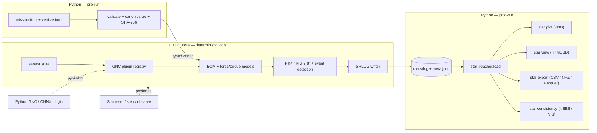

<a id="top"></a>

<div align="center">

<picture>
  <source media="(prefers-color-scheme: dark)" srcset="assets/banner-dark.svg">
  
</picture>

<br>

<!-- Honest static badges only — no fake CI/coverage/version badges. -->
[-6E56CF?style=flat-square)](#roadmap)


[](#faq)

[Why](#why) · [Architecture](#architecture) · [Quickstart](#quickstart) · [Design guarantees](#design-guarantees) · [Roadmap](#roadmap) · [Cite](#how-to-cite)

</div>

---

> A small, deterministic six-degree-of-freedom space-mission simulator whose every physical model is derived, cited, and validated — reproducible bit-for-bit, from a Raspberry Pi to a workstation.

**star_reacher** is a high-fidelity 6DOF simulator for launch vehicles, satellites, and lunar/Mars missions, built as a small C++17/Eigen compute core behind a Python analysis frontend. It is a research instrument — for mission analysis, GNC algorithm development, and world-model and AI/ML spacecraft-navigation research — not a game and not an operational flight tool. The full specification lives in [`PRD.md`](PRD.md); this README is the front door.

> [!IMPORTANT]
> **Status: specification baseline. No code is implemented yet.** The repository currently contains the PRD, this README, and project memory. The `star` CLI, the C++ core, and every command shown below are the *target* interface defined by the spec — they are Phase-1 work, not shipped. Track what is actually built in the [Roadmap](#roadmap).

## Why

Research-grade 6DOF astrodynamics tooling tends to fall into two camps: heavyweight, closed, or hard-to-audit flight-analysis suites, or game-grade simulators that trade physical rigor for approachability. Neither gives you a *small*, fully-scrutinized, bit-reproducible core with AI/ML navigation hooks designed in from the start. star_reacher is built to be exactly that: every logged quantity traces to a derived, cited, and tested model, and the same inputs on the same binary always produce bit-identical outputs.

| Without star_reacher | With star_reacher |
| --- | --- |
| Black-box or game-grade sims; models you cannot audit | Every model carries a first-principles derivation, domain-of-validity bounds, and validation evidence (golden vectors, analytic benchmarks, GMAT cross-checks) |
| "Works on my machine" numerical drift | Bit-identical reruns, CI-gated by SHA-256 with no tolerance |
| Heavy dependency stacks (HDF5, SPICE, native 3D apps) | Eigen-only core; a bespoke binary log; a self-contained HTML viewer |
| Desktop-bound | Runs from a Raspberry Pi 5 to a workstation, no GPU required |
| ML/GNC bolted on after the fact | A stepping API, seeded sensor emulation, and a GNC plugin interface from the first commit |

## Architecture

**Boundary rule: everything inside the deterministic time loop is C++; everything before t₀ or after t_f is Python.** Python validates and canonicalizes TOML config, hashes it, and passes a typed struct across a pybind11 binding; the C++ core never parses text, touches the network, or reads the clock. The core writes a self-describing binary log (SRLOG) whose header binds every output to its exact inputs.



The C++ core (`star::`) owns time systems, reference frames, force/torque composition, integrators, the Chebyshev ephemeris evaluator, gravity/atmosphere/SRP models, vehicle mass properties and propulsion, sensors, built-in GNC components, event detection, the SRLOG writer, and the PRNG. The Python package (`star_reacher`) owns the `star` CLI, TOML validation, Monte Carlo orchestration, the loader and exporters, plotting, HTML viewer generation, the docs build, ephemeris repacking, and the Gym/ONNX adapters.

## Quickstart

> These are the **target** commands specified for Phase 1 — they are not yet implemented. Once Phase 1 ships, a new user reaches a rendered 3D trajectory in four commands from a clean machine (the verification-first onboarding, DX-5/FR-31):

```text
pip install .                          # install the star CLI + native core
star verify --quick                    # smoke-test determinism & models (< 60 s on a Pi 5)
star run missions/ascent_leo.toml      # fly a scripted pad-to-LEO ascent
star view out/ascent_leo.srlog         # open a self-contained 3D playback in any browser
```

The intended everyday loop is three commands with zero intermediate steps: run a baseline, edit one value in a vehicle or mission TOML, run the variant, then `star plot out/a out/b --overlay …`. Every plotted curve is labeled with its resolved-config hash, so a plot can never be misattributed to the wrong edit.

## Design guarantees

<!-- The invariants that make this trustworthy. All are specified to be enforced by CI/lint, not left aspirational. -->
1. **Bit-identical reruns** — same platform + same binary → SHA-256-identical logs, CI-gated with no tolerance; cross-platform divergence is bounded (≤ 1e-9 relative on reference missions), measured, and published rather than assumed.
2. **No model without its math and its tests** — a chapter-manifest lint maps every core model module to a required LaTeX math-library chapter and its golden-vector unit tests (committed before implementation); a model missing either is a red build.
3. **Minimal by enforcement** — CI checks that the installed runtime dependency set exactly equals the allowed-list (`numpy`, `matplotlib`, `jplephem`, plus declared extras) and that each platform wheel stays under a 20 MB budget.
4. **No silent defaults** — a missing required vehicle parameter aborts the run and names the exact table/key, its units, and a typical range; unknown keys are errors, and all validation errors report together.
5. **Every output traces to its inputs** — each SRLOG header embeds the resolved-config SHA-256, the binary's git hash, and the master seed, binding the log to the exact configuration that produced it.
6. **Offline forever** — the HTML viewer makes zero network requests (verifiable offline) and consumes only the log; a five-year-old log replays identically anywhere.

## Roadmap

Eight independently shippable phases, each ending in red-team-checkable exit criteria (full detail in [`PRD.md` §8](PRD.md)). Honest status — only the specification baseline exists today:

- [x] **Spec baseline** — full PRD: 32 functional requirements, 19 keyed decisions, an 8-phase plan, and a requirements-traceability matrix. *(This document set.)*
- [ ] **Phase 1 — Skeleton, contracts, doc scaffold.** Repo builds/installs/logs deterministically; `star` CLI with a two-body placeholder; SRLOG v1 + loader; CI on all four platforms; doc skeletons; license/visibility decision recorded. *Not yet built.*
- [ ] **Phase 2 — Math kernel.** Time systems, reference frames, DE440 ephemeris repack + evaluator, RK4/RKF7(8) integrators with dense output and events. *Not yet built.*
- [ ] **Phase 3 — Environment force models.** Harmonic gravity, third-body, SRP with conical shadow, atmospheres and drag; first cross-tool cases. *Not yet built.*
- [ ] **Phase 4 — Vehicle 6DOF.** KSP-lite vehicle schema + validator, mass properties, propulsion, aero, attitude dynamics, staging; starter fleet; ascent and trans-lunar missions. *Not yet built.*
- [ ] **Phase 5 — Data out.** `star plot`, the `star view` HTML viewer, NPZ/Parquet exporters, and live performance gates. *Not yet built.*
- [ ] **Phase 6 — Sensors, GNC, stepping API.** Sensor suite, GNC plugin interface (C++/Python), `Sim` stepping API, `star consistency` NEES/NIS gates. *Not yet built.*
- [ ] **Phase 7 — Batch, Monte Carlo, ML layer.** `star mc` sweeps, MC regression goldens, the Gymnasium and ONNX adapters. *Not yet built.*
- [ ] **Phase 8 — Validation campaign, report, release.** Full cross-tool table, the scientific report, a fresh-machine walkthrough, and a tagged release with wheels. *Not yet built.*

## Data in, data out

- **In:** TOML for everything — missions, vehicles, sensor presets, and sweep specs — with units in the key names (`thrust_vac_N`) and comments carrying each parameter's justification.
- **Out:** a versioned, self-describing binary log (SRLOG) plus a `meta.json` sidecar. `star_reacher.load(path)` returns NumPy structured arrays (no sim install required to read a log), with optional `to_pandas()`; `star export` writes CSV and NPZ, and Parquet behind an extra. NPZ is the ML-training interchange.

## How to cite

The publication machinery is specified (D-18/FR-31) and lands with Phase 1: a `CITATION.cff` at the repository root, a math-library PDF, and a scientific-report PDF, all carrying the author byline **Melvin Hoyer III**, with a CI check keeping the README BibTeX consistent with `CITATION.cff`. Until the first tagged release, treat the following as the intended citation (version and DOI forthcoming):

```bibtex
@software{hoyer_star_reacher,
  author  = {Hoyer, III, Melvin},
  title   = {{star\_reacher}: a small, deterministic 6DOF space-mission simulator},
  year    = {2026},
  url      = {https://github.com/JusHoya/star_reacher},
  note    = {Version and DOI forthcoming}
}
```

## FAQ

<details>
<summary><b>Is anything implemented yet?</b></summary>

No. The specification baseline (the PRD) is complete, and this README describes the system it defines. Implementation begins with Phase 1. The Roadmap reflects the true state: only the spec baseline is checked.

</details>

<details>
<summary><b>Why not just use GMAT, STK, or KSP?</b></summary>

Those tools are excellent at what they do, and star_reacher validates against GMAT (with Orekit as a tie-breaker). The gap it targets is a *small, fully-auditable, bit-reproducible* core: every model derived and cited in a published math library, minimal dependencies, hardware reach down to a Raspberry Pi, and AI/ML navigation hooks (a stepping API, sensor emulation, GNC plugins) present from the first commit rather than bolted on.

</details>

<details>
<summary><b>What is the license?</b></summary>

Undecided, deliberately. A public commit of substantive technical content is a legal disclosure event (a 12-month US grace clock; it can forfeit patent rights in absolute-novelty jurisdictions), so the license and visibility choice — MIT vs. Apache-2.0 vs. all-rights-reserved — is an explicit open decision to be made before the first substantive public push. The development plan proceeds identically either way.

</details>

<details>
<summary><b>Why C++ and Python?</b></summary>

Determinism lives in a single-threaded C++ core with fixed evaluation order and fast-math disabled; everything that benefits from an ecosystem — config validation, plotting, Monte Carlo orchestration, ML adapters — lives in Python. A versioned binary-log contract and pybind11 bindings join the two.

</details>

<details>
<summary><b>Will it really run on a Raspberry Pi 5?</b></summary>

That is the hardware floor and a binding performance gate, not an afterthought: a multi-day cislunar transfer targets under 60 s of wall time on a single Pi 5 core, and `star verify` runs the acceptance subset in under 10 minutes on the same hardware.

</details>

---

<div align="center">
<sub>A research instrument for reproducible 6DOF astrodynamics. · <a href="#top">back to top ↑</a></sub>
</div>
