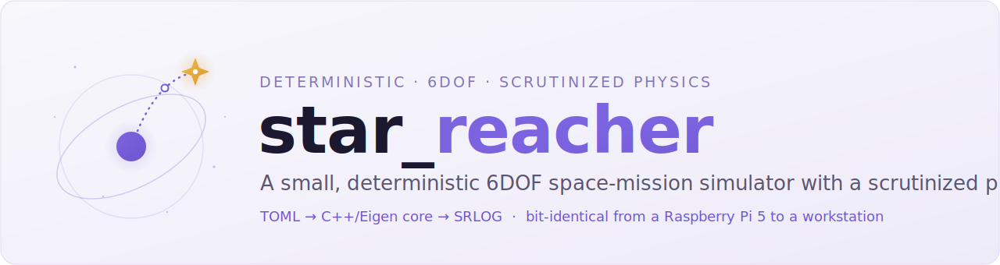
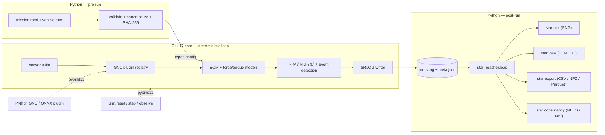

<a id="top"></a>

<div align="center">

<picture>
  <source media="(prefers-color-scheme: dark)" srcset="assets/banner-dark.svg">
  
</picture>

<br>

<!-- Honest badges only: the real CI workflow and the decided license. -->
[](https://github.com/JusHoya/star_reacher/actions/workflows/ci.yml)
[](LICENSE)

[Why](#why) · [Architecture](#architecture) · [Quickstart](#quickstart) · [Design guarantees](#design-guarantees) · [Roadmap](#roadmap) · [Cite](#how-to-cite) · [License](#license)

</div>

---

> A small, deterministic six-degree-of-freedom space-mission simulator whose every physical model is derived, cited, and validated — reproducible bit-for-bit, from a Raspberry Pi to a workstation.

**star_reacher** is a high-fidelity 6DOF simulator for launch vehicles, satellites, and lunar/Mars missions, built as a small C++17/Eigen compute core behind a Python analysis frontend. It is a research instrument — for mission analysis, GNC algorithm development, and world-model and AI/ML spacecraft-navigation research — not a game and not an operational flight tool. The full specification lives in [`PRD.md`](PRD.md); this README is the front door.

> [!IMPORTANT]
> **Status: Phase 1 (skeleton, contracts, and doc scaffold).** The repository builds, installs, logs, and documents deterministically: the `star` CLI runs a two-body placeholder mission, the SRLOG v1 log format has a writer and a pure-Python reader, the documentation and citation machinery is CI-gated, and the license is decided (Apache-2.0, [ADR 0001](docs/adr/0001-license-and-visibility.md)). No production physics is implemented yet — that begins in Phase 2. Track what is actually built in the [Roadmap](#roadmap).

## Why

Research-grade 6DOF astrodynamics tooling tends to fall into two camps: heavyweight, closed, or hard-to-audit flight-analysis suites, or game-grade simulators that trade physical rigor for approachability. Neither gives you a *small*, fully-scrutinized, bit-reproducible core with AI/ML navigation hooks designed in from the start. star_reacher is built to be exactly that: every logged quantity traces to a derived, cited, and tested model, and the same inputs on the same binary always produce bit-identical outputs.

| Without star_reacher | With star_reacher |
| --- | --- |
| Black-box or game-grade sims; models you cannot audit | Every model carries a first-principles derivation, domain-of-validity bounds, and validation evidence (golden vectors, analytic benchmarks, GMAT cross-checks) |
| "Works on my machine" numerical drift | Bit-identical reruns, CI-gated by SHA-256 with no tolerance |
| Heavy dependency stacks (HDF5, SPICE, native 3D apps) | Eigen-only core; a bespoke binary log; a self-contained HTML viewer |
| Desktop-bound | Runs from a Raspberry Pi 5 to a workstation, no GPU required |
| ML/GNC bolted on after the fact | A stepping API, seeded sensor emulation, and a GNC plugin interface from the first commit |

## Architecture

**Boundary rule: everything inside the deterministic time loop is C++; everything before t₀ or after t_f is Python.** Python validates and canonicalizes TOML config, hashes it, and passes a typed struct across a pybind11 binding; the C++ core never parses text, touches the network, or reads the clock. The core writes a self-describing binary log (SRLOG) whose header binds every output to its exact inputs.



The C++ core (`star::`) owns time systems, reference frames, force/torque composition, integrators, the Chebyshev ephemeris evaluator, gravity/atmosphere/SRP models, vehicle mass properties and propulsion, sensors, built-in GNC components, event detection, the SRLOG writer, and the PRNG. The Python package (`star_reacher`) owns the `star` CLI, TOML validation, Monte Carlo orchestration, the loader and exporters, plotting, HTML viewer generation, the docs build, ephemeris repacking, and the Gym/ONNX adapters.

## Quickstart

Four commands, all real and copy-pasteable today (verification-first onboarding, DX-5/FR-31). Prerequisites: Python ≥ 3.11, a C++17 compiler, and CMake ≥ 3.26.

```text
pip install .                                  # build the native core and install the star CLI
star verify --quick                            # run the acceptance smoke tier (< 60 s; ends "VERIFY: PASS")
star run missions/twobody_leo.toml             # propagate the two-body reference mission -> out/twobody-leo/
star export --csv out/twobody-leo/run.srlog    # export every logged channel to CSV, round-trip exact
```

`star plot` (quicklook PNGs) and `star view` (self-contained HTML 3D playback) land in Phase 5; `star docs` builds both PDFs today if a TeX distribution with `latexmk` and `biber` is installed. The everyday loop once plotting lands is three commands with zero intermediate steps: run a baseline, edit one TOML value, run the variant, overlay the plots — every curve labeled with its resolved-config hash so a plot can never be misattributed to the wrong edit.

## Design guarantees

<!-- The invariants that make this trustworthy. All are specified to be enforced by CI/lint, not left aspirational. -->
1. **Bit-identical reruns** — same platform + same binary → SHA-256-identical logs, CI-gated with no tolerance; cross-platform divergence is bounded (≤ 1e-9 relative on reference missions), measured, and published rather than assumed.
2. **No model without its math and its tests** — a chapter-manifest lint maps every core model module to a required LaTeX math-library chapter and its golden-vector unit tests (committed before implementation); a model missing either is a red build.
3. **Minimal by enforcement** — CI checks that the installed runtime dependency set exactly equals the allowed-list (`numpy`, `matplotlib`, `jplephem`, plus declared extras) and that each platform wheel stays under a 20 MB budget.
4. **No silent defaults** — a missing required vehicle parameter aborts the run and names the exact table/key, its units, and a typical range; unknown keys are errors, and all validation errors report together.
5. **Every output traces to its inputs** — each SRLOG header embeds the resolved-config SHA-256, the binary's git hash, and the master seed, binding the log to the exact configuration that produced it.
6. **Offline forever** — the HTML viewer makes zero network requests (verifiable offline) and consumes only the log; a five-year-old log replays identically anywhere.

## Roadmap

Eight independently shippable phases, each gated on red-team-checkable exit criteria (full detail in [`PRD.md` §8](PRD.md)). Honest status per phase:

| Phase | Scope | Exit criteria (summary) | Status |
| --- | --- | --- | --- |
| — | **Spec baseline** — full PRD: 32 functional requirements, 19 keyed decisions, requirements traceability | Document set complete and internally consistent | Complete |
| 1 | **Skeleton, contracts, doc scaffold** — repo builds/installs/logs deterministically; `star` CLI with two-body placeholder; SRLOG v1 writer + pure-Python loader; RNG streams; doc + citation machinery; CI matrix; license decision (D-19) | `pip install .` on all four CI legs; double-run SHA-256 identity; minor-version log read forward, major/corrupt rejected nonzero; CSV round-trips bit-exact; both PDFs build with zero LaTeX errors and chapter lint enforces model-without-chapter as red; `cffconvert --validate` + README BibTeX match; `verify --quick` < 60 s with `VERIFY: PASS` on the ARM leg | In progress (this change set) |
| 2 | **Math kernel** — time systems, frames, DE440 repack + Chebyshev evaluator, RK4/RKF7(8) with dense output, event detection | Time/frame conversions match SOFA/ERFA (1e-9 s, 1e-11 matrix elements); ephemeris < 1 m vs Horizons; integrator convergence slopes 4.0 ± 0.2 / ≥ 7.5; events < 1 µs; cross-platform divergence measured and ≤ 1e-9 relative | Planned |
| 3 | **Environment force models** — harmonic gravity, third-body, SRP + conical shadow, atmospheres and drag | Accelerations < 1e-12 relative vs independent synthesis; J2 secular rates within 0.5 %; shadow times within 0.1 s; LEO cross-tool RMS < 10 m (GMAT) and < 100 m with drag (Orekit) | Planned |
| 4 | **Vehicle 6DOF** — KSP-lite schema + validator, mass properties, propulsion, aero, attitude, staging; starter fleet; ascent + TLI missions | Validator mutation tests; Tsiolkovsky closure within 0.1 %; torque-free attitude benchmarks; staging momentum conservation to 1e-12; ascent and TLI missions run in one command each with SHA-256-identical reruns | Planned |
| 5 | **Data out** — `star plot`, `star view` HTML playback, NPZ/Parquet exporters, performance gates | Headless PNGs on a Pi 5; viewer opens offline with zero network requests; exports round-trip; Pi 5 gates (cislunar < 60 s wall, ascent ≥ 100× real time); dependency and wheel-size minimality gates live | Planned |
| 6 | **Sensors, GNC, stepping API** — `ISensor` suite, GNC plugin interface (C++/Python), `Sim` stepping API, `star consistency` | Sensor statistics inside chi-square bounds; Allan deviation recovers IMU coefficients within ±10 %; reference EKF passes ensemble NEES/NIS 95 % gates; step-wise and batch runs hash-identical | Planned |
| 7 | **Batch, Monte Carlo, ML layer** — `star mc` sweeps, MC regression goldens, Gymnasium + ONNX extras | 256/256 sweep manifest success with per-run reproducibility; MC statistics within distributional bounds; `check_env` passes; ONNX controller closes the loop on x86-64 and Pi 5 | Planned |
| 8 | **Validation campaign, report, release** — full cross-tool table, completed report, fresh-machine walkthrough, tagged release | Every cross-tool case within stated tolerance (e.g., trans-lunar < 1 km at arrival); byte-identical doc rebuilds; fresh-machine README walkthrough succeeds; release wheels pass `verify --quick` on all four platforms | Planned |

## Data in, data out

- **In:** TOML for everything — missions, vehicles, sensor presets, and sweep specs — with units in the key names (`thrust_vac_N`) and comments carrying each parameter's justification.
- **Out:** a versioned, self-describing binary log (SRLOG, format spec in [`docs/formats/srlog_v1.md`](docs/formats/srlog_v1.md)) plus a `meta.json` sidecar written by the CLI. The log itself contains no wall-clock or host data, so it is byte-comparable across reruns.

Reading a log needs only NumPy — the reader is pure Python and works without the compiled core, so analysis machines never need a compiler:

```python
from star_reacher import load

run = load("out/twobody-leo/run.srlog")
run.header["config_sha256"]        # the exact configuration that produced this file
r = run.groups["truth"]["r_m"]     # (N, 3) float64, GCRF position
t = run.groups["truth"]["t_s"]     # (N,) float64, strictly increasing
run.events                         # structured array of (t_s, code, detail)
```

`star export --csv` writes one CSV per channel group with floats emitted via `repr`, so every value round-trips to full stored precision. NPZ and Parquet exporters land in Phase 5; NPZ is the ML-training interchange.

## How to cite

Citation metadata lives in [`CITATION.cff`](CITATION.cff) (validated by `cffconvert` in CI); a CI check (`scripts/check_citation.py`) keeps the BibTeX block below consistent with it field for field. The math-library PDF and the scientific-report PDF both carry the author byline **Melvin Hoyer III** and are built by `star docs`.

```bibtex
@software{hoyer_star_reacher,
  author  = {Hoyer, III, Melvin},
  title   = {star\_reacher},
  year    = {2026},
  url     = {https://github.com/JusHoya/star_reacher},
  version = {0.2.0}
}
```

## License

Apache License 2.0 — see [`LICENSE`](LICENSE). The decision (Apache-2.0, public repository) and its rationale, including the patent-disclosure consequences, are recorded in [ADR 0001](docs/adr/0001-license-and-visibility.md).

## FAQ

<details>
<summary><b>Is anything implemented yet?</b></summary>

Phase 1 is the current state: the build/install path, the `star` CLI with a two-body placeholder mission, the SRLOG v1 log format (writer and pure-Python reader), the RNG streams, the verification harness, the documentation and citation machinery, and CI on all four platforms. Production physics (time systems, frames, ephemerides, force models, the vehicle 6DOF) begins in Phase 2. The [Roadmap](#roadmap) reflects the true state per phase.

</details>

<details>
<summary><b>Why not just use GMAT, STK, or KSP?</b></summary>

Those tools are excellent at what they do, and star_reacher validates against GMAT (with Orekit as a tie-breaker). The gap it targets is a *small, fully-auditable, bit-reproducible* core: every model derived and cited in a published math library, minimal dependencies, hardware reach down to a Raspberry Pi, and AI/ML navigation hooks (a stepping API, sensor emulation, GNC plugins) present from the first commit rather than bolted on.

</details>

<details>
<summary><b>What is the license?</b></summary>

Apache License 2.0, with the repository public — decided 2026-07-02 and recorded in [ADR 0001](docs/adr/0001-license-and-visibility.md). Apache-2.0 was chosen over MIT for its explicit patent grant; the decision record also documents the disclosure consequences (the 12-month US grace clock, and the effect on absolute-novelty foreign rights).

</details>

<details>
<summary><b>Why C++ and Python?</b></summary>

Determinism lives in a single-threaded C++ core with fixed evaluation order and fast-math disabled; everything that benefits from an ecosystem — config validation, plotting, Monte Carlo orchestration, ML adapters — lives in Python. A versioned binary-log contract and pybind11 bindings join the two.

</details>

<details>
<summary><b>Will it really run on a Raspberry Pi 5?</b></summary>

That is the hardware floor and a binding performance gate, not an afterthought: a multi-day cislunar transfer targets under 60 s of wall time on a single Pi 5 core, and `star verify` runs the acceptance subset in under 10 minutes on the same hardware.

</details>

---

<div align="center">
<sub>A research instrument for reproducible 6DOF astrodynamics. · <a href="#top">back to top ↑</a></sub>
</div>
