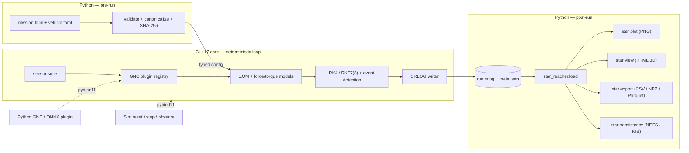

<a id="top"></a>

<div align="center">

<picture>
  <source media="(prefers-color-scheme: dark)" srcset="assets/banner-dark.svg">
  
</picture>

<br>

<!-- Honest badges only: the real CI workflow and the decided license. -->
[](https://github.com/JusHoya/star_reacher/actions/workflows/ci.yml)
[](LICENSE)

[Why](#why) · [Architecture](#architecture) · [Quickstart](#quickstart) · [Design guarantees](#design-guarantees) · [Roadmap](#roadmap) · [Cite](#how-to-cite) · [License](#license)

</div>

---

> A small, deterministic six-degree-of-freedom space-mission simulator whose every physical model is derived, cited, and validated — reproducible bit-for-bit, from a Raspberry Pi to a workstation.

**star_reacher** is a high-fidelity 6DOF simulator for launch vehicles, satellites, and lunar/Mars missions, built as a small C++17/Eigen compute core behind a Python analysis frontend. It is a research instrument — for mission analysis, GNC algorithm development, and world-model and AI/ML spacecraft-navigation research — not a game and not an operational flight tool. The full specification lives in [`PRD.md`](PRD.md); this README is the front door.

> [!IMPORTANT]
> **Status: Phase 7 (batch, Monte Carlo, ML layer) complete.** The AI/ML training and evaluation surface is in: `star mc` expands a TOML sweep spec (grid, list, or Latin hypercube) into an N-worker process pool with per-run seed = SplitMix64(master, index) and a `manifest.json` that makes every run individually reproducible — a 256-run/8-worker LHS sweep finishes 256/256 `success` and any entry re-runs via `star run --seed --set` to its logged SHA-256; a Monte-Carlo regression layer gates ensemble statistics against frozen goldens at chi-square/Anderson–Darling 99 % bounds behind a two-key golden-update path (CI rejects a golden change not carried through the diff-summary tooling); `star_reacher.gym.SpaceEnv` is a ~200-line Gymnasium adapter that passes `check_env` with Gym-side seeding bit-identical to core seeding (the core carries zero Gym knowledge); and `star_reacher.ml.OnnxGnc` runs an ONNX MLP fitted in an external framework as an in-the-loop controller on onnxruntime CPU, closing the loop on x86-64. `star verify` wires the first two criteria as V028/V029, both demonstrated able to fail; the literal Pi 5 and x86-64-versus-aarch64 cross-platform clauses of the ONNX criterion are deferred, fully prepared, to the [pre-release checklist](docs/release_checklist.md) item 9 (PRD §9 valve). Phase 6's audited gate gaps remain tracked as named remediation items — read the [Roadmap](#roadmap) and the PRD's Phase 6 entry before relying on any single Phase 6 criterion.
>
> On top of the Phase 1 skeleton (Apache-2.0 per [ADR 0001](docs/adr/0001-license-and-visibility.md)), the Phase 2 math kernel, the Phase 3 environment force models, and the Phase 4 vehicle 6DOF stack, every run is now inspectable, replayable, and exportable: `star plot` renders the full quicklook PNG set (groundtrack with embedded coastline through per-source force/torque budgets) with its plot-feeding arrays gated by golden vectors; `star view` writes a self-contained single-file HTML WebGL playback viewer (vendored three.js, zero network requests, measured decimation error bound); `star export` adds bit-exact NPZ and pandas-ready Parquet alongside CSV; the loader derives osculating elements; and two new example missions — Mission A (cislunar, the < 60 s Pi 5 performance-gate mission) and a heliocentric Mars-cruise arc on the new Sun central body — run with bit-identical reruns. Performance and dependency-minimality gates are live in CI; the evidence items that need hardware or software the maintainer does not currently have (a Pi 5, a MATLAB license) are fully prepared and registered on the [pre-release checklist](docs/release_checklist.md). Track what is actually built in the [Roadmap](#roadmap).

## Why

Research-grade 6DOF astrodynamics tooling tends to fall into two camps: heavyweight, closed, or hard-to-audit flight-analysis suites, or game-grade simulators that trade physical rigor for approachability. Neither gives you a *small*, fully-scrutinized, bit-reproducible core with AI/ML navigation hooks designed in from the start. star_reacher is built to be exactly that: every logged quantity traces to a derived, cited, and tested model, and the same inputs on the same binary always produce bit-identical outputs.

| Without star_reacher | With star_reacher |
| --- | --- |
| Black-box or game-grade sims; models you cannot audit | Every model carries a first-principles derivation, domain-of-validity bounds, and validation evidence (golden vectors, analytic benchmarks, GMAT cross-checks) |
| "Works on my machine" numerical drift | Bit-identical reruns, CI-gated by SHA-256 with no tolerance |
| Heavy dependency stacks (HDF5, SPICE, native 3D apps) | Eigen-only core; a bespoke binary log; a self-contained HTML viewer |
| Desktop-bound | Runs from a Raspberry Pi 5 to a workstation, no GPU required |
| ML/GNC bolted on after the fact | A stepping API, seeded sensor emulation, and a GNC plugin interface from the first commit |

## Architecture

**Boundary rule: everything inside the deterministic time loop is C++; everything before t₀ or after t_f is Python.** Python validates and canonicalizes TOML config, hashes it, and passes a typed struct across a pybind11 binding; the C++ core never parses text, touches the network, or reads the clock. The core writes a self-describing binary log (SRLOG) whose header binds every output to its exact inputs.



The C++ core (`star::`) owns time systems, reference frames, force/torque composition, integrators, the Chebyshev ephemeris evaluator, gravity/atmosphere/SRP models, vehicle mass properties and propulsion, sensors, built-in GNC components, event detection, the SRLOG writer, and the PRNG. The Python package (`star_reacher`) owns the `star` CLI, TOML validation, Monte Carlo orchestration, the loader and exporters, plotting, HTML viewer generation, the docs build, ephemeris repacking, and the Gym/ONNX adapters.

## Quickstart

Four commands, all real and copy-pasteable today (verification-first onboarding, DX-5/FR-31). Prerequisites: Python ≥ 3.11, a C++17 compiler, and CMake ≥ 3.26.

```text
pip install .                                  # build the native core and install the star CLI
star verify --quick                            # run the acceptance smoke tier (< 60 s; ends "VERIFY: PASS")
star run missions/twobody_leo.toml             # propagate the two-body reference mission -> out/twobody-leo/
star export --csv out/twobody-leo/run.srlog    # export every logged channel to CSV, round-trip exact
```

`star plot` renders the quicklook PNG set headless (groundtrack, altitude/speed, osculating elements, attitude and rates, mass/thrust, dynamic pressure and Mach, per-source force/torque budgets — event markers on every time axis), `star view` writes a self-contained HTML 3D playback viewer that opens offline, and `star docs` builds both PDFs if a TeX distribution with `latexmk` and `biber` is installed. The everyday loop is three commands with zero intermediate steps: run a baseline, edit one TOML value, run the variant, overlay the plots (`star plot a/run.srlog b/run.srlog`) — every curve labeled with its resolved-config hash so a plot can never be misattributed to the wrong edit.

## Design guarantees

<!-- The invariants that make this trustworthy. All are specified to be enforced by CI/lint, not left aspirational. -->
1. **Bit-identical reruns** — same platform + same binary → SHA-256-identical logs, CI-gated with no tolerance; cross-platform divergence is bounded (≤ 1e-9 relative on reference missions), measured, and published rather than assumed.
2. **No model without its math and its tests** — a chapter-manifest lint maps every core model module to a required LaTeX math-library chapter and its golden-vector unit tests (committed before implementation); a model missing either is a red build.
3. **Minimal by enforcement** — CI checks that the installed runtime dependency set exactly equals the allowed-list (`numpy`, `matplotlib`, `jplephem`, plus declared extras) and that each platform wheel stays under a 20 MB budget.
4. **No silent defaults** — a missing required vehicle parameter aborts the run and names the exact table/key, its units, and a typical range; unknown keys are errors, and all validation errors report together.
5. **Every output traces to its inputs** — each SRLOG header embeds the resolved-config SHA-256, the binary's git hash, and the master seed, binding the log to the exact configuration that produced it.
6. **Offline forever** — the HTML viewer makes zero network requests (verifiable offline) and consumes only the log; a five-year-old log replays identically anywhere.

## Roadmap

Eight independently shippable phases, each gated on red-team-checkable exit criteria (full detail in [`PRD.md` §8](PRD.md)). Honest status per phase:

| Phase | Scope | Exit criteria (summary) | Status |
| --- | --- | --- | --- |
| — | **Spec baseline** — full PRD: 32 functional requirements, 19 keyed decisions, requirements traceability | Document set complete and internally consistent | Complete |
| 1 | **Skeleton, contracts, doc scaffold** — repo builds/installs/logs deterministically; `star` CLI with two-body placeholder; SRLOG v1 writer + pure-Python loader; RNG streams; doc + citation machinery; CI matrix; license decision (D-19) | `pip install .` on all four CI legs; double-run SHA-256 identity; minor-version log read forward, major/corrupt rejected nonzero; CSV round-trips bit-exact; both PDFs build with zero LaTeX errors and chapter lint enforces model-without-chapter as red; `cffconvert --validate` + README BibTeX match; `verify --quick` < 60 s with `VERIFY: PASS` on the ARM leg | Complete |
| 2 | **Math kernel** — time systems, frames, DE440 repack + Chebyshev evaluator, RK4/RKF7(8) with dense output, event detection | Time/frame conversions match SOFA/ERFA (1e-9 s, 1e-11 matrix elements); ephemeris < 1 m vs Horizons (lunar quantities gated < 1 mm against DE440 itself, [ADR 0002](docs/adr/0002-lunar-ephemeris-validation-de441.md)); integrator convergence slopes 4.0 ± 0.2 / ≥ 7.5; events < 1 µs; cross-platform divergence measured and ≤ 1e-9 relative | Complete |
| 3 | **Environment force models** — harmonic gravity, third-body, SRP + conical shadow, atmospheres and drag | Accelerations < 1e-12 relative vs independent synthesis; J2 secular rates within 0.5 %; shadow times within 0.1 s; LEO cross-tool RMS < 10 m (GMAT) and < 100 m with drag (Orekit) | Complete |
| 4 | **Vehicle 6DOF** — KSP-lite schema + validator, mass properties, propulsion, aero, attitude, staging; starter fleet; ascent + TLI missions | Validator mutation tests; Tsiolkovsky closure within 0.1 %; torque-free attitude benchmarks; staging momentum conservation to 1e-12; ascent and TLI missions run in one command each with SHA-256-identical reruns; ascent cross-checked against an independent 3DOF within 2 % | Complete |
| 5 | **Data out** — `star plot`, `star view` HTML playback, NPZ/Parquet exporters, Mission A + Mars-cruise missions, performance gates | Headless PNGs gated by golden vectors; viewer opens offline with zero network requests, exact scrub-extreme epochs, measured decimation bound; NPZ round-trips bit-exactly and Parquet loads in pandas (CI-gated); GMAT ephemeris-import transcript committed; Pi 5 gates (cislunar < 60 s wall, ascent ≥ 100× real time, SRLOG ≥ 50 MB/s) live on the ARM64 proxy leg with a documented Pi 5 hardware checklist; dependency and wheel-size minimality gates live | Complete — the MATLAB `parquetread` transcript and the Pi 5 hardware checklist run are deferred, fully prepared, to the [pre-release checklist](docs/release_checklist.md) (PRD §9 valve), which also tracks the first post-merge nightly run |
| 6 | **Sensors, GNC, stepping API** — `ISensor` suite, GNC plugin interface (C++/Python), `Sim` stepping API, `star consistency` | Sensor statistics inside chi-square bounds; Allan deviation recovers IMU coefficients within ±10 %; reference EKF passes ensemble NEES/NIS 95 % gates; step-wise and batch runs hash-identical; the FR-32 ascent target re-gated with the C++ GNC stack in the loop | Deliverables complete, all ten criteria measured — but an internal evidence audit found the gates behind criteria 1, 2, 3, 7, and 9 weaker than their wording implies, so only the criteria it found sound are wired into `star verify`. The open gate defects are listed in the PRD's Phase 6 entry and carried as named remediation items; the Pi 5 hardware clause of criterion 10 is deferred, fully prepared, to the [pre-release checklist](docs/release_checklist.md) (PRD §9 valve) |
| 7 | **Batch, Monte Carlo, ML layer** — `star mc` sweeps, MC regression goldens, Gymnasium + ONNX extras | 256/256 sweep manifest success with per-run reproducibility; MC statistics within distributional bounds; `check_env` passes; ONNX controller closes the loop on x86-64 and Pi 5 | Complete — the four criteria are met and gated: the 256-run/8-worker LHS sweep finishes 256/256 and any entry re-runs via `star run` to its logged SHA-256; MC ensemble statistics gate against frozen goldens at chi-square/Anderson–Darling 99 % bounds behind a two-key golden-update path; `check_env` passes on `SpaceEnv` with Gym-side seeding bit-identical to core seeding; and an ONNX MLP fitted in an external framework closes the loop on x86-64. The literal Pi 5 and the x86-64-versus-aarch64 cross-platform clauses of criterion 4 are deferred, fully prepared, to the [pre-release checklist](docs/release_checklist.md) item 9 (PRD §9 valve) |
| 8 | **Validation campaign, report, release** — full cross-tool table, completed report, fresh-machine walkthrough, tagged release | Every cross-tool case within stated tolerance (e.g., trans-lunar < 1 km at arrival); byte-identical doc rebuilds; fresh-machine README walkthrough succeeds; release wheels pass `verify --quick` on all four platforms | Planned |

## Data in, data out

- **In:** TOML for everything — missions, vehicles, sensor presets, and sweep specs — with units in the key names (`thrust_vac_N`) and comments carrying each parameter's justification.
- **Out:** a versioned, self-describing binary log (SRLOG, format spec in [`docs/formats/srlog_v1.md`](docs/formats/srlog_v1.md)) plus a `meta.json` sidecar written by the CLI. The log itself contains no wall-clock or host data, so it is byte-comparable across reruns.

Reading a log needs only NumPy — the reader is pure Python and works without the compiled core, so analysis machines never need a compiler:

```python
from star_reacher import load

run = load("out/twobody-leo/run.srlog")
run.header["config_sha256"]        # the exact configuration that produced this file
r = run.groups["truth"]["r_m"]     # (N, 3) float64, GCRF position
t = run.groups["truth"]["t_s"]     # (N,) float64, strictly increasing
run.events                         # structured array of (t_s, code, detail)
```

`star export` writes CSV (one file per channel group, floats via `repr` so every value round-trips to full stored precision), NPZ (one pickle-free archive holding every group, the events, and the header — the bit-exact ML-training interchange), and Parquet (one file per group, behind the `pyarrow` extra) — the flags combine freely. Format contracts live in [`docs/formats/`](docs/formats/).

## GNC in the loop

Two surfaces sit on the same seam, and the full guide is [`docs/gnc_plugins.md`](docs/gnc_plugins.md).

**Step a mission one control period at a time.** The core's vehicle loop is a cycle object advanced one period per call, and a batch `star run` is literally a loop over it — so a stepped run and a batch run of one scenario produce byte-identical logs by construction, not by a comparison test.

```python
from star_reacher.sim import Sim

sim = Sim("missions/leo_attitude_gnc.toml", "out/stepped")
obs, info = sim.reset()                        # -> (observation, {config_sha256, seed, ...})
while not sim.done():
    obs = sim.step()                           # one control period; ZOH commands
sim.truth()                                    # privileged: never reaches a GNC component
```

`observe()` is pure — two reads without an intervening `step()` are equal. `step(commands)` drives a mission whose guidance or control slot is the `external` component: unknown command keys raise, and missing keys hold and are logged to `gnc.cmd` on every cycle.

**Fly a component you wrote in Python, with no recompilation.** A plugin file declares `STAR_GNC_COMPONENTS = {"my_control": MyControl}`; a mission names it in the reserved `python:` namespace; `--gnc-plugin` loads it.

```console
$ star run missions/leo_attitude_gnc_plugin.toml \
      --gnc-plugin examples/gnc_plugins/pd_attitude.py
```

The prefix keeps validation strict without a core or a plugin present — a misspelt built-in is still a hard error, not a presumed plugin — and makes a plugin unable to shadow a built-in, since the namespaces are disjoint. The shipped [example](examples/gnc_plugins/pd_attitude.py) reimplements the built-in `pd_attitude` law and commands torques identical to it on the reference mission, which is what makes it a check on the seam rather than a demonstration that some Python ran.

Two caveats, stated plainly. Loading a plugin **executes its code** with the privileges of the process running `star`; plugins are never fetched over a network and never auto-discovered, so a mission file alone can never cause code execution. And a plugin runs *inside* the deterministic time loop, so bit-identical reruns hold only as far as the plugin's own code does — no clock, no I/O, no unseeded RNG, no set iteration, no mutable global state. The CLI restates that contract every time the flag is used.

## How to cite

Citation metadata lives in [`CITATION.cff`](CITATION.cff) (validated by `cffconvert` in CI); a CI check (`scripts/check_citation.py`) keeps the BibTeX block below consistent with it field for field. The math-library PDF and the scientific-report PDF both carry the author byline **Melvin Hoyer III** and are built by `star docs`.

```bibtex
@software{hoyer_star_reacher,
  author  = {Hoyer, III, Melvin},
  title   = {star\_reacher},
  year    = {2026},
  url     = {https://github.com/JusHoya/star_reacher},
  version = {0.7.0}
}
```

## License

Apache License 2.0 — see [`LICENSE`](LICENSE). The decision (Apache-2.0, public repository) and its rationale, including the patent-disclosure consequences, are recorded in [ADR 0001](docs/adr/0001-license-and-visibility.md).

## FAQ

<details>
<summary><b>Is anything implemented yet?</b></summary>

Through Phase 7: the build/install path, the `star` CLI, the SRLOG log format, the RNG streams, the verification harness, and the documentation and citation machinery on all four CI platforms (Phase 1); TAI/UTC/TT/TDB time systems, the GCRF/ITRF/Moon-PA/Mars-IAU frame family, the DE440s ephemeris pipeline, RK4/RKF7(8) integrators, and event detection (Phase 2); the full orbital perturbation environment — harmonic gravity, third-body, SRP with conical shadow, and atmospheric drag, composed behind `star run` with frozen GMAT/Orekit cross-tool baselines (Phase 3); the vehicle 6DOF — KSP-lite vehicle schema and validator, analytic mass properties, propulsion, RCS and reaction-wheel actuators, axisymmetric aero, rigid-body attitude with gravity-gradient torque, and staging with the state remap, exercised by a starter fleet flying scripted ascent and trans-lunar-injection missions and cross-checked against an independent 3DOF ascent (Phase 4); and the data-out layer — the `star plot` quicklook set gated by golden vectors, the `star view` self-contained HTML playback viewer, NPZ/Parquet exporters, loader-derived osculating elements, the Sun central body with the Mission A and Mars-cruise example missions, and the CI performance and minimality gates (Phase 5); and the sensing and GNC layer — the `ISensor` suite with presets, the `IGncComponent` interface with built-in C++ components and a Python plugin path, the `Sim` stepping API, the reference error-state EKF, `star consistency`, and the closed-loop GNC ascent that re-gates the FR-32 ascent throughput target (Phase 6); and the batch, Monte Carlo, and ML layer — `star mc` grid/list/Latin-hypercube sweeps over an N-worker process pool with a reproducible per-run `manifest.json` (per-run seed = SplitMix64(master, index), any entry re-runs via `star run --seed --set` to its logged SHA-256), the Monte-Carlo regression gate at chi-square/Anderson–Darling 99 % bounds behind a two-key golden-update path, the `SpaceEnv` Gymnasium adapter (passes `check_env`, Gym-side seeding bit-identical to core seeding), and the `OnnxGnc` onnxruntime-CPU in-the-loop learned controller (Phase 7). The [Roadmap](#roadmap) reflects the true state per phase, including which Phase 6 exit criteria rest on gates an internal audit found weak.

</details>

<details>
<summary><b>Why not just use GMAT, STK, or KSP?</b></summary>

Those tools are excellent at what they do, and star_reacher validates against GMAT (with Orekit as a tie-breaker). The gap it targets is a *small, fully-auditable, bit-reproducible* core: every model derived and cited in a published math library, minimal dependencies, hardware reach down to a Raspberry Pi, and AI/ML navigation hooks (a stepping API, sensor emulation, GNC plugins) present from the first commit rather than bolted on.

</details>

<details>
<summary><b>What is the license?</b></summary>

Apache License 2.0, with the repository public — decided 2026-07-02 and recorded in [ADR 0001](docs/adr/0001-license-and-visibility.md). Apache-2.0 was chosen over MIT for its explicit patent grant; the decision record also documents the disclosure consequences (the 12-month US grace clock, and the effect on absolute-novelty foreign rights).

</details>

<details>
<summary><b>Why C++ and Python?</b></summary>

Determinism lives in a single-threaded C++ core with fixed evaluation order and fast-math disabled; everything that benefits from an ecosystem — config validation, plotting, Monte Carlo orchestration, ML adapters — lives in Python. A versioned binary-log contract and pybind11 bindings join the two.

</details>

<details>
<summary><b>Will it really run on a Raspberry Pi 5?</b></summary>

That is the hardware floor and a binding performance gate, not an afterthought: a multi-day cislunar transfer targets under 60 s of wall time on a single Pi 5 core, and `star verify` runs the acceptance subset in under 10 minutes on the same hardware.

</details>

---

<div align="center">
<sub>A research instrument for reproducible 6DOF astrodynamics. · <a href="#top">back to top ↑</a></sub>
</div>
